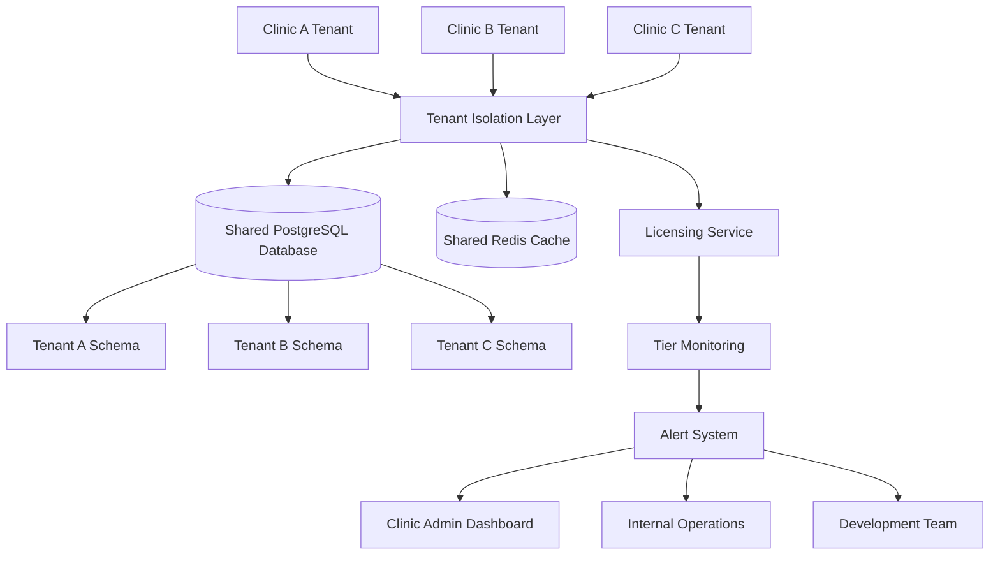
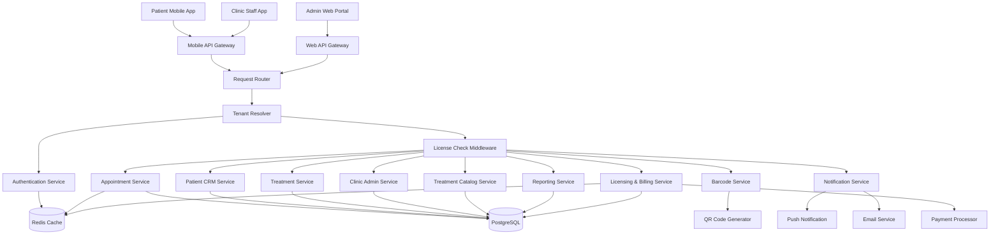
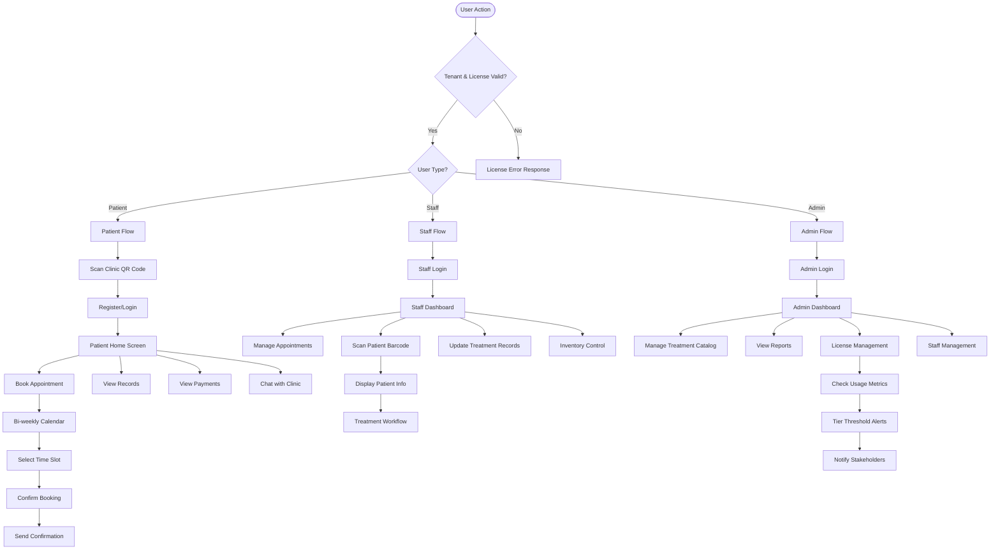
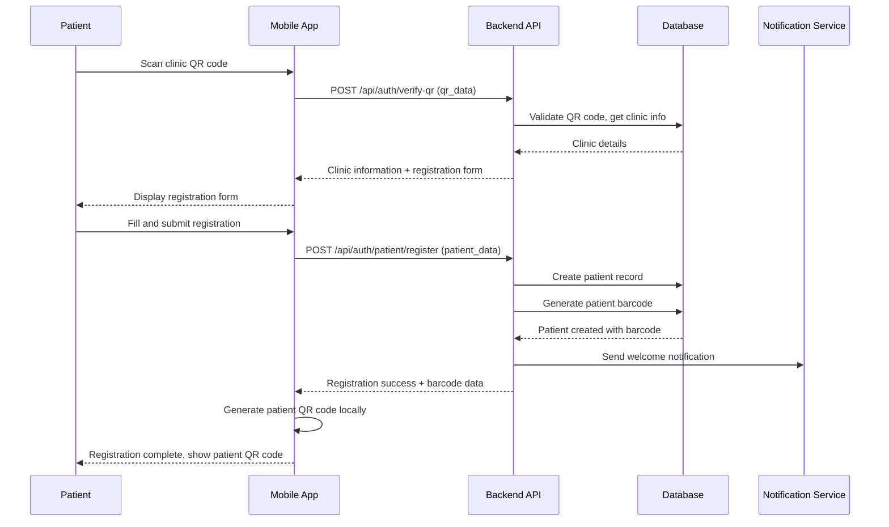
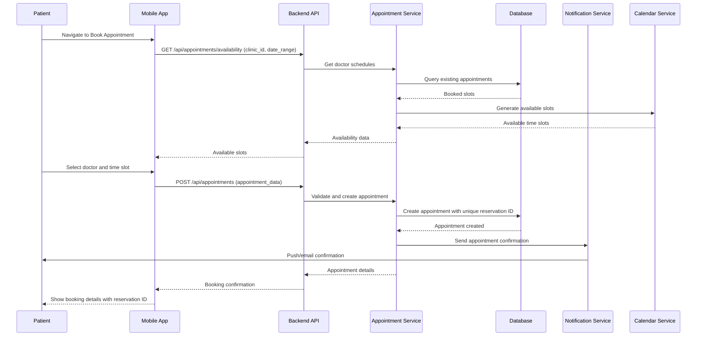
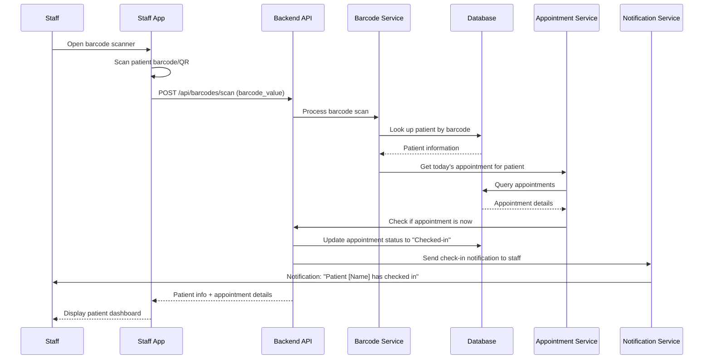
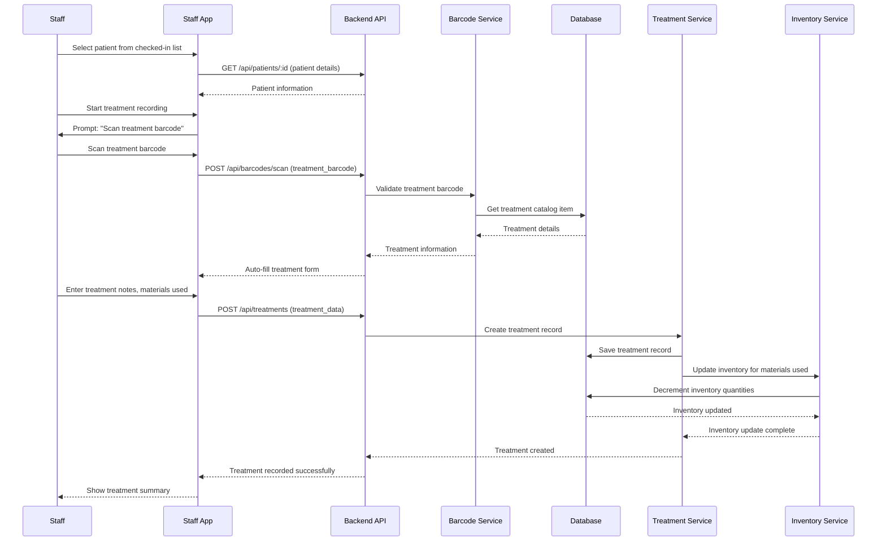
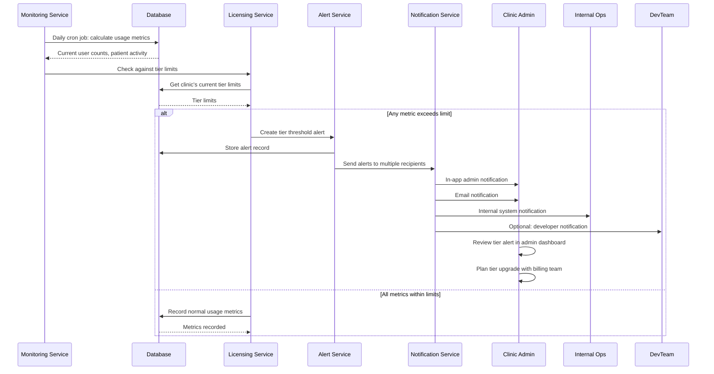
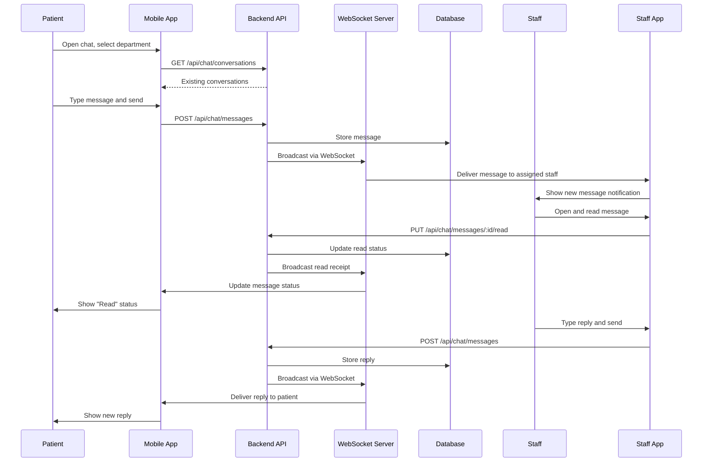

# Clinic CRM & Patient Engagement App - System Architecture Document (v0.90.4)

## Introduction

This document defines the full-stack system architecture for the Clinic CRM & Patient Engagement Mobile Application (aligned with PRD v0.90.4), incorporating mobile app architecture, B2B SaaS multi-tenant licensing system, appointment booking, treatment record management, barcode-based identification, and clinic workflow automation.

**Relationship to Frontend Architecture:** This project includes mobile applications (iOS/Android) and potentially web interfaces. Separate mobile architecture documents will detail platform-specific implementations and MUST be used in conjunction with this document.

### Change Log

| Date       | Version | Description                               | Author          |
| ---------- | ------- | ----------------------------------------- | --------------- |
| 2025-12-20 | 0.90.4   | Initial architecture based on PRD v0.90.4 | Architect Agent |

## High Level Architecture

### Technical Summary

The Clinic CRM & Patient Engagement App is a B2B SaaS mobile application platform built with React Native for cross-platform mobile development and Node.js/NestJS for backend services, using PostgreSQL as primary database with Redis for caching and session management. The architecture follows a multi-tenant microservices pattern with clear service boundaries for clinic isolation. The system implements tiered licensing with automated monitoring, QR-code-based patient onboarding, bi-weekly appointment scheduling, treatment catalog management, barcode-based workflow automation, and real-time notifications.

### High Level Project Diagram

```mermaid
graph TB
    %% Patient and Clinic Users
    Patient[Patient Mobile App] --> MobileAPI[Mobile API Gateway]
    ClinicStaff[Clinic Staff App] --> MobileAPI
    ClinicAdmin[Clinic Admin Web] --> WebAPI[Web API Gateway]
    
    %% API Gateways
    MobileAPI --> Auth[Authentication Service]
    MobileAPI --> Appointment[Appointment Service]
    MobileAPI --> PatientCRM[Patient CRM Service]
    MobileAPI --> Treatment[Treatment Service]
    MobileAPI --> Notification[Notification Service]
    MobileAPI --> Barcode[Barcode Service]
    
    WebAPI --> Auth
    WebAPI --> ClinicAdminSvc[Clinic Admin Service]
    WebAPI --> Licensing[Licensing Service]
    WebAPI --> Reporting[Reporting Service]
    WebAPI --> Catalog[Treatment Catalog Service]
    
    %% Core Services
    Appointment --> DB[(PostgreSQL)]
    PatientCRM --> DB
    Treatment --> DB
    ClinicAdminSvc --> DB
    Licensing --> DB
    Reporting --> DB
    Catalog --> DB
    
    %% Licensing & Billing
    Licensing --> Billing[Billing Service]
    Billing --> PaymentGateway[Payment Gateway]
    Licensing --> Monitoring[Usage Monitoring]
    Monitoring --> Alert[Alert Service]
    
    %% External Integrations
    Notification --> Push[Push Notification Service]
    Notification --> Email[Email Service]
    Push --> APNS[Apple Push Notification]
    Push --> FCM[Firebase Cloud Messaging]
    
    %% Cache & Performance
    Auth --> Redis[(Redis Cache)]
    Appointment --> Redis
    Licensing --> Redis
    
    %% Barcode System
    Barcode --> Scanner[Mobile Barcode Scanner]
    Barcode --> Generator[QR Code Generator]
```



### Multi-Tenant Architecture Diagram



### System Block Diagram



### Architectural and Design Patterns

- **Multi-Tenant Architecture**: Database per tenant schema with shared infrastructure
- **API-First Design**: RESTful APIs with OpenAPI specification for all services
- **Strategy Pattern**: For different appointment booking modes and bank integrations
- **Observer Pattern**: For real-time appointment updates and notification delivery
- **Factory Pattern**: For barcode/QR code generation and treatment record creation
- **Repository Pattern**: Abstract data access through repository interfaces
- **Middleware Pattern**: For tenant resolution and licensing checks on every request
- **Publisher-Subscriber Pattern**: For asynchronous event processing (appointment changes, tier alerts)
- **Circuit Breaker Pattern**: For external service integrations (payment, push notifications)
- **CQRS Pattern**: For reporting and analytics separate from transaction processing

## Processing Flow Chart



## Tech Stack

### Cloud Infrastructure

- **Provider**: AWS (Amazon Web Services)
- **Key Services**: ECS Fargate, RDS PostgreSQL, ElastiCache Redis, S3, CloudFront, SNS, SES, Lambda
- **Deployment Regions**: Primary region based on clinic locations, with disaster recovery region

### Technology Stack Table

| Category                  | Technology                 | Version    | Purpose                    | Rationale                                                      |
| ------------------------- | -------------------------- | ---------- | -------------------------- | -------------------------------------------------------------- |
| **Mobile Framework**      | React Native               | 0.73.0     | Cross-platform mobile apps | Single codebase for iOS/Android, large ecosystem               |
| **Backend Runtime**       | Node.js                    | 20.11.0    | Server-side JavaScript     | LTS version, async capabilities, team expertise                |
| **Backend Framework**     | NestJS                     | 10.0.0     | API framework              | TypeScript support, modular architecture, dependency injection |
| **API Gateway**           | AWS API Gateway            | -          | API management             | Rate limiting, caching, security policies                      |
| **Database**              | PostgreSQL                 | 15.0       | Primary data store         | ACID compliance, JSON support, multi-tenant ready              |
| **ORM**                   | Prisma                     | 5.0.0      | Database client            | Type safety, migrations, excellent DX                          |
| **Caching**               | Redis                      | 7.0.0      | Session storage & caching  | High performance, pub/sub capabilities                         |
| **Authentication**        | JWT                        | 9.0.0      | Token-based auth           | Stateless, scalable, industry standard                         |
| **Push Notifications**    | Firebase Cloud Messaging   | 12.0.0     | Android push notifications | Google ecosystem, reliable delivery                            |
| **Push Notifications**    | Apple Push Notification    | -          | iOS push notifications     | Required for iOS apps                                          |
| **Email Service**         | Amazon SES                 | -          | Transactional emails       | Reliable, cost-effective, high deliverability                  |
| **Barcode/QR Generation** | qrcode                     | 1.5.3      | QR code generation         | Client-side generation, minimal dependencies                   |
| **Barcode Scanning**      | react-native-vision-camera | 3.9.0      | Mobile barcode scanning    | High performance, modern camera API                            |
| **File Storage**          | Amazon S3                  | -          | Document/image storage     | Scalable, secure, cost-effective                               |
| **Payment Processing**    | Stripe API                 | 2023-10-16 | Subscription billing       | Global coverage, robust API, PCI compliant                     |
| **Monitoring**            | Datadog                    | -          | Application monitoring     | Comprehensive observability, alerting                          |
| **Containerization**      | Docker                     | 20.10.0    | Container runtime          | Environment consistency, scaling                               |
| **CI/CD**                 | GitHub Actions             | -          | Automation                 | GitHub integration, flexible workflows                         |
| **Mobile Testing**        | Detox                      | 20.0.0     | E2E mobile testing         | Reliable mobile automation                                     |
| **Backend Testing**       | Jest                       | 29.0.0     | Testing framework          | Comprehensive testing, snapshot support                        |

## Data Models

### Clinic Model
**Purpose:** Store clinic tenant information and configuration

**Key Attributes:**
- `id`: UUID - Primary identifier
- `name`: String - Clinic display name
- `clinic_type`: Enum(Medical Aesthetic, Dental, Pediatric, etc.) - Clinic specialization
- `license_tier`: Enum(Tier S, Tier M, Tier L, Tier XL) - Current license tier
- `subscription_status`: Enum(Active, Past Due, Suspended, Cancelled) - Billing status
- `max_users`: Integer - Maximum clinic staff users allowed
- `max_patients`: Integer - Maximum patient users allowed (QAU)
- `current_user_count`: Integer - Current number of staff users
- `current_patient_count`: Integer - Current number of active patients
- `quarterly_revenue_range`: Enum(Entry-level, Mid-range, High, Custom) - Revenue bracket
- `billing_contact_email`: String - Billing contact email
- `technical_contact_email`: String - Technical contact email

**Relationships:**
- Has many Users (staff)
- Has many Patients
- Has many Appointments
- Has many TreatmentRecords
- Has many TreatmentCatalog items
- Has many Barcode mappings

### Patient Model
**Purpose:** Store patient information and medical history

**Key Attributes:**
- `id`: UUID - Primary identifier
- `clinic_id`: UUID - Reference to clinic tenant
- `barcode_id`: String - Unique barcode identifier
- `qr_code_data`: String - QR code data for patient app
- `first_name`: String - Patient first name
- `last_name`: String - Patient last name
- `date_of_birth`: Date - Patient birth date
- `contact_email`: String - Patient contact email
- `contact_phone`: String - Patient contact phone
- `emergency_contact`: JSONB - Emergency contact information
- `medical_history`: JSONB - Medical history notes
- `allergies`: JSONB - Allergy information
- `current_medications`: JSONB - Current medications
- `last_visit_date`: Date - Date of last visit
- `next_appointment_date`: Date - Date of next appointment
- `is_active`: Boolean - Active patient status
- `preferred_language`: Enum(EN, ZH-TW, ZH-CN, JA, etc.) - Language preference

**Relationships:**
- Belongs to a Clinic
- Has many Appointments
- Has many TreatmentRecords
- Has many PaymentRecords
- Has many ChatMessages

### StaffUser Model
**Purpose:** Store clinic staff user information and permissions

**Key Attributes:**
- `id`: UUID - Primary identifier
- `clinic_id`: UUID - Reference to clinic tenant
- `email`: String - Unique login identifier
- `password_hash`: String - Hashed password
- `first_name`: String - Staff first name
- `last_name`: String - Staff last name
- `role`: Enum(Doctor, Nurse, Receptionist, Admin, Manager) - Staff role
- `permissions`: JSONB - Role-based permissions
- `is_active`: Boolean - Active staff status
- `last_login`: DateTime - Last login timestamp
- `two_factor_enabled`: Boolean - 2FA status
- `specialization`: String - Medical specialization (for doctors)

**Relationships:**
- Belongs to a Clinic
- Has many Appointments (as assigned doctor)
- Has many TreatmentRecords (as treating staff)
- Has many ChatMessages

### Appointment Model
**Purpose:** Track patient appointments and scheduling

**Key Attributes:**
- `id`: UUID - Primary identifier
- `clinic_id`: UUID - Reference to clinic tenant
- `patient_id`: UUID - Reference to patient
- `doctor_id`: UUID - Reference to staff (doctor)
- `reservation_id`: String - Unique reservation identifier
- `appointment_date`: Date - Appointment date
- `start_time`: Time - Appointment start time
- `end_time`: Time - Appointment end time
- `duration_minutes`: Integer - Appointment duration
- `appointment_type`: Enum(Consultation, Treatment, Follow-up, Emergency) - Type of appointment
- `status`: Enum(Scheduled, Confirmed, Checked-in, In-progress, Completed, Cancelled, No-show) - Current status
- `reason_for_visit`: String - Reason for appointment
- `notes`: Text - Appointment notes
- `cancellation_reason`: String - Reason for cancellation (if cancelled)
- `booking_mode`: Enum(Specific Time, Time Period) - Booking mode used
- `treatment_plan_id`: UUID - Reference to treatment plan (if applicable)
- `reminder_sent`: Boolean - Reminder notification sent status
- `check_in_time`: DateTime - Actual check-in time
- `check_out_time`: DateTime - Actual check-out time

**Relationships:**
- Belongs to a Clinic
- Belongs to a Patient
- Belongs to a StaffUser (doctor)
- Has one TreatmentRecord
- Has one PaymentRecord

### TreatmentRecord Model
**Purpose:** Store patient treatment history and details

**Key Attributes:**
- `id`: UUID - Primary identifier
- `clinic_id`: UUID - Reference to clinic tenant
- `patient_id`: UUID - Reference to patient
- `appointment_id`: UUID - Reference to appointment
- `doctor_id`: UUID - Reference to treating doctor
- `treatment_date`: Date - Date of treatment
- `treatment_type_id`: UUID - Reference to treatment catalog
- `treatment_name`: String - Name of treatment performed
- `description`: Text - Treatment description
- `duration_minutes`: Integer - Treatment duration
- `materials_used`: JSONB - List of materials/medications used
- `cost`: Decimal - Treatment cost
- `discount_applied`: Decimal - Discount amount (if any)
- `final_amount`: Decimal - Final amount charged
- `notes`: Text - Clinical notes
- `follow_up_required`: Boolean - Follow-up required flag
- `follow_up_date`: Date - Suggested follow-up date
- `next_treatment_suggestion`: JSONB - System-generated suggestions
- `complications`: Text - Any complications noted
- `patient_feedback`: Text - Patient feedback on treatment
- `barcode_scanned`: Boolean - Barcode verification status
- `inventory_items_used`: JSONB - Inventory items consumed

**Relationships:**
- Belongs to a Clinic
- Belongs to a Patient
- Belongs to an Appointment
- Belongs to a StaffUser (doctor)
- Belongs to a TreatmentCatalog item
- Has one PaymentRecord

### TreatmentCatalog Model
**Purpose:** Store clinic's treatment offerings and pricing

**Key Attributes:**
- `id`: UUID - Primary identifier
- `clinic_id`: UUID - Reference to clinic tenant
- `name`: String - Treatment name
- `description`: Text - Treatment description
- `category`: Enum(Cosmetic, Therapeutic, Diagnostic, Preventive) - Treatment category
- `subcategory`: String - More specific category
- `duration_minutes`: Integer - Typical duration
- `base_price`: Decimal - Base price
- `currency`: String - Currency code
- `advantages`: Text[] - List of advantages
- `instructions`: Text - Pre/post treatment instructions
- `cautions`: Text[] - List of cautions/contraindications
- `recommended_for`: Text[] - Recommended for conditions
- `is_active`: Boolean - Active treatment flag
- `requires_doctor_approval`: Boolean - Doctor approval required
- `material_requirements`: JSONB - Required materials
- `default_inventory_items`: JSONB - Default inventory consumption

**Relationships:**
- Belongs to a Clinic
- Has many TreatmentRecords

### BarcodeMapping Model
**Purpose:** Map barcodes to patients, treatments, and inventory items

**Key Attributes:**
- `id`: UUID - Primary identifier
- `clinic_id`: UUID - Reference to clinic tenant
- `barcode_value`: String - Unique barcode value
- `entity_type`: Enum(Patient, Treatment, Inventory, Medicine) - Type of entity
- `entity_id`: UUID - Reference to entity (patient_id, treatment_id, etc.)
- `purpose`: Enum(Identification, Treatment Tracking, Inventory Control, Medication) - Barcode purpose
- `generated_at`: DateTime - When barcode was generated
- `generated_by`: UUID - Staff user who generated
- `last_scanned_at`: DateTime - Last scan timestamp
- `last_scanned_by`: UUID - Staff user who last scanned
- `scan_count`: Integer - Total number of scans
- `is_active`: Boolean - Active barcode flag
- `expiry_date`: Date - Barcode expiry date (if applicable)

**Relationships:**
- Belongs to a Clinic
- Polymorphic relationship to various entities

### InventoryItem Model
**Purpose:** Track clinic inventory and supplies

**Key Attributes:**
- `id`: UUID - Primary identifier
- `clinic_id`: UUID - Reference to clinic tenant
- `name`: String - Item name
- `description`: Text - Item description
- `category`: Enum(Medicine, Equipment, Supply, Consumable) - Item category
- `sku`: String - Stock keeping unit
- `barcode_value`: String - Associated barcode
- `current_quantity`: Integer - Current stock quantity
- `minimum_quantity`: Integer - Minimum stock threshold
- `maximum_quantity`: Integer - Maximum stock capacity
- `unit_of_measure`: Enum(Each, Box, Bottle, Pack, Tube) - Measurement unit
- `last_restocked`: Date - Last restock date
- `next_restock_date`: Date - Planned restock date
- `supplier_info`: JSONB - Supplier information
- `unit_cost`: Decimal - Cost per unit
- `location`: String - Storage location
- `is_tracked`: Boolean - Barcode tracking enabled
- `usage_history`: JSONB - Usage tracking

**Relationships:**
- Belongs to a Clinic
- Has many InventoryTransactions

### LicenseUsage Model
**Purpose:** Track license usage metrics for tier monitoring

**Key Attributes:**
- `id`: UUID - Primary identifier
- `clinic_id`: UUID - Reference to clinic tenant
- `metric_date`: Date - Date of metric collection
- `metric_type`: Enum(Daily Active Users, Weekly Active Users, Monthly Active Users, Quarterly Active Users) - Metric type
- `active_user_count`: Integer - Active staff users count
- `active_patient_count`: Integer - Active patient users count
- `appointment_count`: Integer - Appointment count
- `treatment_count`: Integer - Treatment count
- `revenue_amount`: Decimal - Revenue amount (if available)
- `tier_threshold_exceeded`: Boolean - Tier limit exceeded flag
- `exceeded_metric`: String - Which metric exceeded limit
- `notification_sent`: Boolean - Alert notification sent
- `notification_sent_to`: JSONB - Recipients of notification

**Relationships:**
- Belongs to a Clinic

### ChatMessage Model
**Purpose:** Store patient-clinic communication

**Key Attributes:**
- `id`: UUID - Primary identifier
- `clinic_id`: UUID - Reference to clinic tenant
- `patient_id`: UUID - Reference to patient
- `sender_type`: Enum(Patient, Staff, System) - Who sent the message
- `sender_id`: UUID - Reference to sender (patient_id or staff_id)
- `recipient_type`: Enum(Patient, Staff, Department) - Message recipient
- `recipient_id`: UUID - Reference to recipient
- `message_type`: Enum(Text, Image, Voice, Document) - Type of message
- `content`: Text - Message content
- `media_url`: String - URL for media content
- `is_read`: Boolean - Read status
- `read_at`: DateTime - When message was read
- `department`: Enum(General, Billing, Medical, Appointment) - Department category
- `priority`: Enum(Low, Normal, High, Urgent) - Message priority
- `related_appointment_id`: UUID - Reference to appointment (if related)
- `related_treatment_id`: UUID - Reference to treatment (if related)

**Relationships:**
- Belongs to a Clinic
- Belongs to a Patient
- Belongs to a StaffUser (if sender/recipient is staff)

## Components

### Authentication Service
**Responsibility:** Handle user registration, login, and session management for patients and staff

**Key Interfaces:**
- `POST /api/auth/patient/register` - Patient registration via QR code
- `POST /api/auth/patient/login` - Patient login
- `POST /api/auth/staff/login` - Staff login
- `POST /api/auth/logout` - User logout
- `POST /api/auth/refresh` - Token refresh
- `POST /api/auth/verify-qr` - Verify QR code for patient onboarding

**Dependencies:** User Repository, JWT Service, QR Code Service, Redis Cache
**Technology Stack:** NestJS, JWT, bcrypt, Redis, QR Code generation

### Appointment Service
**Responsibility:** Handle appointment booking, management, and scheduling logic

**Key Interfaces:**
- `GET /api/appointments/availability` - Get available time slots
- `POST /api/appointments` - Create new appointment
- `GET /api/appointments` - List appointments with filters
- `PUT /api/appointments/:id` - Update appointment
- `DELETE /api/appointments/:id` - Cancel appointment
- `GET /api/appointments/calendar` - Get bi-weekly calendar view
- `POST /api/appointments/:id/check-in` - Check-in patient
- `POST /api/appointments/:id/check-out` - Check-out patient

**Dependencies:** Appointment Repository, Patient Repository, Staff Repository, Calendar Service, Notification Service
**Technology Stack:** NestJS, Prisma, node-cron for recurring scheduling

### Patient CRM Service
**Responsibility:** Manage patient relationships, records, and communication

**Key Interfaces:**
- `GET /api/patients` - List patients with filters
- `GET /api/patients/:id` - Get patient details
- `PUT /api/patients/:id` - Update patient information
- `GET /api/patients/:id/records` - Get patient treatment history
- `POST /api/patients/:id/barcode` - Generate/regenerate patient barcode
- `GET /api/patients/search` - Search patients
- `POST /api/patients/:id/merge` - Merge duplicate patient records

**Dependencies:** Patient Repository, Treatment Repository, Barcode Service
**Technology Stack:** NestJS, Prisma, Barcode/QR generation libraries

### Treatment Service
**Responsibility:** Handle treatment record creation, updates, and tracking

**Key Interfaces:**
- `POST /api/treatments` - Create treatment record
- `GET /api/treatments` - List treatments with filters
- `GET /api/treatments/:id` - Get treatment details
- `PUT /api/treatments/:id` - Update treatment record
- `POST /api/treatments/:id/complete` - Mark treatment as completed
- `GET /api/treatments/:id/suggestions` - Get system-generated suggestions
- `POST /api/treatments/:id/inventory` - Record inventory usage

**Dependencies:** Treatment Repository, Appointment Repository, Inventory Service, Suggestion Engine
**Technology Stack:** NestJS, Prisma, AI/ML for treatment suggestions

### Barcode Service
**Responsibility:** Handle barcode generation, scanning, and workflow integration

**Key Interfaces:**
- `POST /api/barcodes/generate` - Generate new barcode
- `POST /api/barcodes/scan` - Process barcode scan
- `GET /api/barcodes/:value` - Get barcode information
- `POST /api/barcodes/patient/:id` - Generate patient barcode
- `POST /api/barcodes/treatment/:id` - Generate treatment barcode
- `POST /api/barcodes/inventory/:id` - Generate inventory barcode
- `GET /api/barcodes/scans/:id` - Get scan history

**Dependencies:** Barcode Repository, Patient Service, Treatment Service, Inventory Service
**Technology Stack:** NestJS, QR Code libraries, Barcode scanning SDK integration

### Licensing Service
**Responsibility:** Manage clinic licensing tiers, usage monitoring, and alerts

**Key Interfaces:**
- `GET /api/licensing/tiers` - Get tier definitions and limits
- `GET /api/licensing/current` - Get current clinic license status
- `GET /api/licensing/usage` - Get current usage metrics
- `GET /api/licensing/alerts` - Get active tier alerts
- `POST /api/licensing/upgrade` - Request tier upgrade
- `POST /api/licensing/downgrade` - Request tier downgrade
- `GET /api/licensing/history` - Get license change history

**Dependencies:** License Repository, Clinic Repository, Monitoring Service, Alert Service
**Technology Stack:** NestJS, Prisma, Monitoring libraries, Alerting system

### Treatment Catalog Service
**Responsibility:** Manage clinic's treatment offerings and pricing catalog

**Key Interfaces:**
- `GET /api/catalog/treatments` - List all treatments
- `POST /api/catalog/treatments` - Add new treatment
- `PUT /api/catalog/treatments/:id` - Update treatment
- `DELETE /api/catalog/treatments/:id` - Deactivate treatment
- `GET /api/catalog/categories` - Get treatment categories
- `POST /api/catalog/categories` - Add new category
- `GET /api/catalog/pricing` - Get pricing information
- `PUT /api/catalog/pricing/:id` - Update pricing

**Dependencies:** Catalog Repository, Clinic Repository
**Technology Stack:** NestJS, Prisma

### Inventory Service
**Responsibility:** Manage clinic inventory tracking and control

**Key Interfaces:**
- `GET /api/inventory/items` - List inventory items
- `POST /api/inventory/items` - Add new inventory item
- `PUT /api/inventory/items/:id` - Update inventory item
- `DELETE /api/inventory/items/:id` - Remove inventory item
- `POST /api/inventory/scan` - Process inventory scan
- `POST /api/inventory/adjust` - Adjust inventory quantity
- `GET /api/inventory/low-stock` - Get low stock alerts
- `POST /api/inventory/reorder` - Create reorder request

**Dependencies:** Inventory Repository, Barcode Service, Notification Service
**Technology Stack:** NestJS, Prisma

### Notification Service
**Responsibility:** Handle all system notifications across channels

**Key Interfaces:**
- `POST /api/notifications/appointment` - Send appointment notifications
- `POST /api/notifications/treatment` - Send treatment reminders
- `POST /api/notifications/license` - Send license alerts
- `POST /api/notifications/broadcast` - Send broadcast messages
- `GET /api/notifications` - Get user notifications
- `PUT /api/notifications/:id/read` - Mark notification as read
- `POST /api/notifications/preferences` - Update notification preferences

**Dependencies:** Notification Repository, Push Service, Email Service, SMS Service
**Technology Stack:** NestJS, Firebase Cloud Messaging, APNS, Amazon SES, Twilio

### Chat Service
**Responsibility:** Handle patient-clinic messaging and communication

**Key Interfaces:**
- `GET /api/chat/conversations` - List user conversations
- `GET /api/chat/conversations/:id/messages` - Get conversation messages
- `POST /api/chat/messages` - Send new message
- `PUT /api/chat/messages/:id` - Edit message
- `DELETE /api/chat/messages/:id` - Delete message
- `POST /api/chat/conversations` - Start new conversation
- `GET /api/chat/departments` - Get clinic departments
- `POST /api/chat/upload` - Upload media for chat

**Dependencies:** Chat Repository, Patient Repository, Staff Repository, File Storage Service
**Technology Stack:** NestJS, WebSocket for real-time, S3 for media storage

### Reporting Service
**Responsibility:** Generate reports and analytics for clinics

**Key Interfaces:**
- `GET /api/reports/appointments` - Appointment reports
- `GET /api/reports/treatments` - Treatment reports
- `GET /api/reports/revenue` - Revenue reports
- `GET /api/reports/patient-growth` - Patient growth reports
- `GET /api/reports/staff-performance` - Staff performance reports
- `GET /api/reports/inventory` - Inventory reports
- `POST /api/reports/custom` - Generate custom report
- `GET /api/reports/export/:id` - Export report

**Dependencies:** Various repositories, Data aggregation service
**Technology Stack:** NestJS, Prisma, Data visualization libraries, PDF generation

## External APIs

### Stripe API
- **Purpose:** Subscription billing and payment processing
- **Documentation:** https://stripe.com/docs/api
- **Base URL:** https://api.stripe.com
- **Authentication:** API keys (secret key, publishable key)
- **Rate Limits:** 100 read requests per second, 100 write requests per second

**Key Endpoints Used:**
- `POST /v1/customers` - Create customer
- `POST /v1/subscriptions` - Create subscription
- `POST /v1/invoices` - Create invoice
- `GET /v1/subscriptions/:id` - Retrieve subscription
- `POST /v1/subscriptions/:id` - Update subscription
- `POST /v1/payment_methods` - Attach payment method

**Integration Notes:** PCI compliance required, webhook integration for payment events

### Firebase Cloud Messaging (FCM)
- **Purpose:** Push notifications for Android devices
- **Documentation:** https://firebase.google.com/docs/cloud-messaging
- **Base URL:** https://fcm.googleapis.com
- **Authentication:** Service account JSON key
- **Rate Limits:** Varies by plan

**Key Endpoints Used:**
- `POST /fcm/send` - Send message to device or topic
- `POST /v1/projects/{project_id}/messages:send` - Send message (HTTP v1 API)

**Integration Notes:** Requires Firebase project setup, device token management

### Apple Push Notification Service (APNS)
- **Purpose:** Push notifications for iOS devices
- **Documentation:** https://developer.apple.com/documentation/usernotifications
- **Base URL:** https://api.push.apple.com (production), https://api.sandbox.push.apple.com (sandbox)
- **Authentication:** APNs authentication token (JWT)
- **Rate Limits:** No explicit rate limits, but rapid connection opening/closing may be throttled

**Key Endpoints Used:**
- `POST /3/device/{device_token}` - Send notification to device

**Integration Notes:** Requires Apple Developer account, certificate or token-based authentication

### Amazon Simple Email Service (SES)
- **Purpose:** Transactional email delivery
- **Documentation:** https://docs.aws.amazon.com/ses/
- **Base URL:** https://email.{region}.amazonaws.com
- **Authentication:** AWS Signature Version 4
- **Rate Limits:** Varies by sending quota and region

**Key Endpoints Used:**
- `POST /` - Send email (with appropriate Action parameter)
- `POST /v2/email/outbound-emails` - Send email (SendEmail API)

**Integration Notes:** Requires domain verification, sandbox mode initially

### QR Code Generation API (Optional)
- **Purpose:** Generate QR codes for patient onboarding
- **Documentation:** Various providers (QRCode.js for client-side, qrcode for server-side)
- **Base URL:** Client-side generation preferred for security
- **Authentication:** Not required for client-side generation
- **Rate Limits:** Client-side: none; Server-side: varies by provider

**Integration Notes:** Client-side generation recommended to avoid exposing patient data in URLs

## Core Workflows

### Patient Onboarding via QR Code Sequence



### Appointment Booking Sequence



### Barcode-Based Patient Check-in Sequence



### Treatment Recording with Barcode Verification Sequence



### License Tier Threshold Detection Sequence



### Real-time Chat Between Patient and Clinic Sequence



## REST API Spec

```yaml
openapi: 3.0.0
info:
  title: Clinic CRM & Patient Engagement API
  version: 1.0.0
  description: API for clinic management and patient engagement mobile application
servers:
  - url: https://api.clinic-crm.com/v1
    description: Production server
  - url: http://localhost:3000/api
    description: Development server

components:
  securitySchemes:
    bearerAuth:
      type: http
      scheme: bearer
      bearerFormat: JWT
    clinicApiKey:
      type: apiKey
      in: header
      name: X-Clinic-API-Key

paths:
  /auth/patient/register:
    post:
      summary: Register patient via QR code
      requestBody:
        required: true
        content:
          application/json:
            schema:
              type: object
              properties:
                qr_code:
                  type: string
                  description: Clinic QR code data
                first_name:
                  type: string
                last_name:
                  type: string
                date_of_birth:
                  type: string
                  format: date
                contact_email:
                  type: string
                  format: email
                contact_phone:
                  type: string
                password:
                  type: string
                  format: password
      responses:
        '201':
          description: Patient registered successfully
          content:
            application/json:
              schema:
                type: object
                properties:
                  patient_id:
                    type: string
                    format: uuid
                  barcode_data:
                    type: string
                  qr_code_data:
                    type: string
                  access_token:
                    type: string
        '400':
          description: Invalid QR code or registration data
          
  /appointments/availability:
    get:
      summary: Get available appointment slots
      security:
        - bearerAuth: []
      parameters:
        - name: clinic_id
          in: query
          required: true
          schema:
            type: string
            format: uuid
        - name: start_date
          in: query
          required: true
          schema:
            type: string
            format: date
        - name: end_date
          in: query
          required: true
          schema:
            type: string
            format: date
        - name: doctor_id
          in: query
          schema:
            type: string
            format: uuid
      responses:
        '200':
          description: Available slots retrieved
          content:
            application/json:
              schema:
                type: object
                properties:
                  available_slots:
                    type: array
                    items:
                      $ref: '#/components/schemas/TimeSlot'
                  
  /appointments:
    post:
      summary: Create new appointment
      security:
        - bearerAuth: []
      requestBody:
        required: true
        content:
          application/json:
            schema:
              type: object
              properties:
                clinic_id:
                  type: string
                  format: uuid
                patient_id:
                  type: string
                  format: uuid
                doctor_id:
                  type: string
                  format: uuid
                appointment_date:
                  type: string
                  format: date
                start_time:
                  type: string
                  format: time
                end_time:
                  type: string
                  format: time
                appointment_type:
                  type: string
                  enum: [Consultation, Treatment, Follow-up, Emergency]
                reason_for_visit:
                  type: string
                booking_mode:
                  type: string
                  enum: [Specific Time, Time Period]
      responses:
        '201':
          description: Appointment created successfully
          content:
            application/json:
              schema:
                $ref: '#/components/schemas/Appointment'
                
  /barcodes/scan:
    post:
      summary: Process barcode scan
      security:
        - bearerAuth: []
      requestBody:
        required: true
        content:
          application/json:
            schema:
              type: object
              properties:
                barcode_value:
                  type: string
                scanner_type:
                  type: string
                  enum: [Patient Check-in, Treatment Verification, Inventory Control]
                location:
                  type: string
                  description: Where the scan occurred
      responses:
        '200':
          description: Barcode processed successfully
          content:
            application/json:
              schema:
                type: object
                properties:
                  entity_type:
                    type: string
                  entity_data:
                    type: object
                  action_required:
                    type: string
                    
  /licensing/usage:
    get:
      summary: Get current license usage metrics
      security:
        - bearerAuth: []
        - clinicApiKey: []
      parameters:
        - name: clinic_id
          in: query
          required: true
          schema:
            type: string
            format: uuid
        - name: period
          in: query
          schema:
            type: string
            enum: [daily, weekly, monthly, quarterly]
            default: monthly
      responses:
        '200':
          description: Usage metrics retrieved
          content:
            application/json:
              schema:
                $ref: '#/components/schemas/LicenseUsage'
                
  /notifications/appointment:
    post:
      summary: Send appointment notification
      security:
        - clinicApiKey: []
      requestBody:
        required: true
        content:
          application/json:
            schema:
              type: object
              properties:
                appointment_id:
                  type: string
                  format: uuid
                notification_type:
                  type: string
                  enum: [Confirmation, Reminder, Cancellation, Reschedule]
                channels:
                  type: array
                  items:
                    type: string
                    enum: [push, email, sms]
      responses:
        '200':
          description: Notification sent successfully
          
components:
  schemas:
    TimeSlot:
      type: object
      properties:
        start_time:
          type: string
          format: date-time
        end_time:
          type: string
          format: date-time
        doctor_id:
          type: string
          format: uuid
        doctor_name:
          type: string
        available:
          type: boolean
        
    Appointment:
      type: object
      properties:
        id:
          type: string
          format: uuid
        reservation_id:
          type: string
        patient_name:
          type: string
        doctor_name:
          type: string
        appointment_date:
          type: string
          format: date
        start_time:
          type: string
          format: time
        status:
          type: string
        appointment_type:
          type: string
        
    LicenseUsage:
      type: object
      properties:
        clinic_id:
          type: string
          format: uuid
        current_tier:
          type: string
        max_users:
          type: integer
        current_users:
          type: integer
        max_patients:
          type: integer
        current_patients:
          type: integer
        usage_percentage:
          type: number
        threshold_warning:
          type: boolean
        exceeded_metrics:
          type: array
          items:
            type: string
```

## Database Schema

### Core Tables

```sql
-- Clinics table (multi-tenant foundation)
CREATE TABLE clinics (
    id UUID PRIMARY KEY DEFAULT gen_random_uuid(),
    name VARCHAR(255) NOT NULL,
    clinic_type VARCHAR(50) NOT NULL,
    license_tier VARCHAR(20) NOT NULL CHECK (license_tier IN ('Tier S', 'Tier M', 'Tier L', 'Tier XL')),
    subscription_status VARCHAR(20) DEFAULT 'Active' CHECK (subscription_status IN ('Active', 'Past Due', 'Suspended', 'Cancelled')),
    max_users INTEGER NOT NULL,
    max_patients INTEGER NOT NULL,
    current_user_count INTEGER DEFAULT 0,
    current_patient_count INTEGER DEFAULT 0,
    quarterly_revenue_range VARCHAR(50) CHECK (quarterly_revenue_range IN ('Entry-level', 'Mid-range', 'High', 'Custom')),
    billing_contact_email VARCHAR(255),
    technical_contact_email VARCHAR(255),
    timezone VARCHAR(50) DEFAULT 'UTC',
    created_at TIMESTAMP DEFAULT CURRENT_TIMESTAMP,
    updated_at TIMESTAMP DEFAULT CURRENT_TIMESTAMP,
    INDEX idx_clinics_license_tier (license_tier),
    INDEX idx_clinics_subscription_status (subscription_status)
);

-- Patients table
CREATE TABLE patients (
    id UUID PRIMARY KEY DEFAULT gen_random_uuid(),
    clinic_id UUID NOT NULL REFERENCES clinics(id) ON DELETE CASCADE,
    barcode_id VARCHAR(100) UNIQUE NOT NULL,
    qr_code_data TEXT NOT NULL,
    first_name VARCHAR(100) NOT NULL,
    last_name VARCHAR(100) NOT NULL,
    date_of_birth DATE NOT NULL,
    contact_email VARCHAR(255),
    contact_phone VARCHAR(50),
    emergency_contact JSONB DEFAULT '{}'::jsonb,
    medical_history JSONB DEFAULT '{}'::jsonb,
    allergies JSONB DEFAULT '[]'::jsonb,
    current_medications JSONB DEFAULT '[]'::jsonb,
    last_visit_date DATE,
    next_appointment_date DATE,
    is_active BOOLEAN DEFAULT TRUE,
    preferred_language VARCHAR(10) DEFAULT 'EN',
    created_at TIMESTAMP DEFAULT CURRENT_TIMESTAMP,
    updated_at TIMESTAMP DEFAULT CURRENT_TIMESTAMP,
    UNIQUE(clinic_id, barcode_id),
    INDEX idx_patients_clinic_id (clinic_id),
    INDEX idx_patients_barcode_id (barcode_id),
    INDEX idx_patients_active (is_active, clinic_id)
);

-- Staff users table
CREATE TABLE staff_users (
    id UUID PRIMARY KEY DEFAULT gen_random_uuid(),
    clinic_id UUID NOT NULL REFERENCES clinics(id) ON DELETE CASCADE,
    email VARCHAR(255) NOT NULL,
    password_hash VARCHAR(255) NOT NULL,
    first_name VARCHAR(100) NOT NULL,
    last_name VARCHAR(100) NOT NULL,
    role VARCHAR(50) NOT NULL CHECK (role IN ('Doctor', 'Nurse', 'Receptionist', 'Admin', 'Manager')),
    permissions JSONB DEFAULT '{}'::jsonb,
    is_active BOOLEAN DEFAULT TRUE,
    last_login TIMESTAMP,
    two_factor_enabled BOOLEAN DEFAULT FALSE,
    specialization VARCHAR(100),
    created_at TIMESTAMP DEFAULT CURRENT_TIMESTAMP,
    updated_at TIMESTAMP DEFAULT CURRENT_TIMESTAMP,
    UNIQUE(clinic_id, email),
    INDEX idx_staff_clinic_id (clinic_id),
    INDEX idx_staff_role (role, clinic_id)
);

-- Appointments table
CREATE TABLE appointments (
    id UUID PRIMARY KEY DEFAULT gen_random_uuid(),
    clinic_id UUID NOT NULL REFERENCES clinics(id) ON DELETE CASCADE,
    patient_id UUID NOT NULL REFERENCES patients(id) ON DELETE CASCADE,
    doctor_id UUID NOT NULL REFERENCES staff_users(id) ON DELETE CASCADE,
    reservation_id VARCHAR(50) UNIQUE NOT NULL,
    appointment_date DATE NOT NULL,
    start_time TIME NOT NULL,
    end_time TIME NOT NULL,
    duration_minutes INTEGER NOT NULL,
    appointment_type VARCHAR(50) NOT NULL CHECK (appointment_type IN ('Consultation', 'Treatment', 'Follow-up', 'Emergency')),
    status VARCHAR(50) DEFAULT 'Scheduled' CHECK (status IN ('Scheduled', 'Confirmed', 'Checked-in', 'In-progress', 'Completed', 'Cancelled', 'No-show')),
    reason_for_visit TEXT,
    notes TEXT,
    cancellation_reason TEXT,
    booking_mode VARCHAR(20) CHECK (booking_mode IN ('Specific Time', 'Time Period')),
    treatment_plan_id UUID,
    reminder_sent BOOLEAN DEFAULT FALSE,
    check_in_time TIMESTAMP,
    check_out_time TIMESTAMP,
    created_at TIMESTAMP DEFAULT CURRENT_TIMESTAMP,
    updated_at TIMESTAMP DEFAULT CURRENT_TIMESTAMP,
    INDEX idx_appointments_clinic_id (clinic_id),
    INDEX idx_appointments_patient_id (patient_id),
    INDEX idx_appointments_doctor_id (doctor_id),
    INDEX idx_appointments_date_status (appointment_date, status, clinic_id),
    INDEX idx_appointments_reservation_id (reservation_id)
);

-- Treatment records table
CREATE TABLE treatment_records (
    id UUID PRIMARY KEY DEFAULT gen_random_uuid(),
    clinic_id UUID NOT NULL REFERENCES clinics(id) ON DELETE CASCADE,
    patient_id UUID NOT NULL REFERENCES patients(id) ON DELETE CASCADE,
    appointment_id UUID REFERENCES appointments(id) ON DELETE SET NULL,
    doctor_id UUID NOT NULL REFERENCES staff_users(id) ON DELETE CASCADE,
    treatment_date DATE NOT NULL,
    treatment_type_id UUID NOT NULL,
    treatment_name VARCHAR(255) NOT NULL,
    description TEXT,
    duration_minutes INTEGER NOT NULL,
    materials_used JSONB DEFAULT '[]'::jsonb,
    cost DECIMAL(19,4) NOT NULL,
    discount_applied DECIMAL(19,4) DEFAULT 0,
    final_amount DECIMAL(19,4) NOT NULL,
    notes TEXT,
    follow_up_required BOOLEAN DEFAULT FALSE,
    follow_up_date DATE,
    next_treatment_suggestion JSONB DEFAULT '{}'::jsonb,
    complications TEXT,
    patient_feedback TEXT,
    barcode_scanned BOOLEAN DEFAULT FALSE,
    inventory_items_used JSONB DEFAULT '[]'::jsonb,
    created_at TIMESTAMP DEFAULT CURRENT_TIMESTAMP,
    updated_at TIMESTAMP DEFAULT CURRENT_TIMESTAMP,
    INDEX idx_treatments_clinic_id (clinic_id),
    INDEX idx_treatments_patient_id (patient_id),
    INDEX idx_treatments_doctor_id (doctor_id),
    INDEX idx_treatments_date (treatment_date, clinic_id)
);

-- Treatment catalog table
CREATE TABLE treatment_catalog (
    id UUID PRIMARY KEY DEFAULT gen_random_uuid(),
    clinic_id UUID NOT NULL REFERENCES clinics(id) ON DELETE CASCADE,
    name VARCHAR(255) NOT NULL,
    description TEXT,
    category VARCHAR(50) NOT NULL CHECK (category IN ('Cosmetic', 'Therapeutic', 'Diagnostic', 'Preventive')),
    subcategory VARCHAR(100),
    duration_minutes INTEGER NOT NULL,
    base_price DECIMAL(19,4) NOT NULL,
    currency VARCHAR(3) DEFAULT 'USD',
    advantages TEXT[] DEFAULT '{}',
    instructions TEXT,
    cautions TEXT[] DEFAULT '{}',
    recommended_for TEXT[] DEFAULT '{}',
    is_active BOOLEAN DEFAULT TRUE,
    requires_doctor_approval BOOLEAN DEFAULT FALSE,
    material_requirements JSONB DEFAULT '{}'::jsonb,
    default_inventory_items JSONB DEFAULT '[]'::jsonb,
    created_at TIMESTAMP DEFAULT CURRENT_TIMESTAMP,
    updated_at TIMESTAMP DEFAULT CURRENT_TIMESTAMP,
    UNIQUE(clinic_id, name),
    INDEX idx_catalog_clinic_id (clinic_id),
    INDEX idx_catalog_category (category, clinic_id),
    INDEX idx_catalog_active (is_active, clinic_id)
);

-- Barcode mappings table
CREATE TABLE barcode_mappings (
    id UUID PRIMARY KEY DEFAULT gen_random_uuid(),
    clinic_id UUID NOT NULL REFERENCES clinics(id) ON DELETE CASCADE,
    barcode_value VARCHAR(255) UNIQUE NOT NULL,
    entity_type VARCHAR(50) NOT NULL CHECK (entity_type IN ('Patient', 'Treatment', 'Inventory', 'Medicine')),
    entity_id UUID NOT NULL,
    purpose VARCHAR(50) NOT NULL CHECK (purpose IN ('Identification', 'Treatment Tracking', 'Inventory Control', 'Medication')),
    generated_at TIMESTAMP DEFAULT CURRENT_TIMESTAMP,
    generated_by UUID REFERENCES staff_users(id) ON DELETE SET NULL,
    last_scanned_at TIMESTAMP,
    last_scanned_by UUID REFERENCES staff_users(id) ON DELETE SET NULL,
    scan_count INTEGER DEFAULT 0,
    is_active BOOLEAN DEFAULT TRUE,
    expiry_date DATE,
    INDEX idx_barcodes_clinic_id (clinic_id),
    INDEX idx_barcodes_value (barcode_value),
    INDEX idx_barcodes_entity (entity_type, entity_id),
    INDEX idx_barcodes_active (is_active, clinic_id)
);

-- Inventory items table
CREATE TABLE inventory_items (
    id UUID PRIMARY KEY DEFAULT gen_random_uuid(),
    clinic_id UUID NOT NULL REFERENCES clinics(id) ON DELETE CASCADE,
    name VARCHAR(255) NOT NULL,
    description TEXT,
    category VARCHAR(50) NOT NULL CHECK (category IN ('Medicine', 'Equipment', 'Supply', 'Consumable')),
    sku VARCHAR(100) UNIQUE NOT NULL,
    barcode_value VARCHAR(255),
    current_quantity INTEGER DEFAULT 0,
    minimum_quantity INTEGER DEFAULT 5,
    maximum_quantity INTEGER,
    unit_of_measure VARCHAR(20) DEFAULT 'Each' CHECK (unit_of_measure IN ('Each', 'Box', 'Bottle', 'Pack', 'Tube')),
    last_restocked DATE,
    next_restock_date DATE,
    supplier_info JSONB DEFAULT '{}'::jsonb,
    unit_cost DECIMAL(19,4),
    location VARCHAR(100),
    is_tracked BOOLEAN DEFAULT FALSE,
    usage_history JSONB DEFAULT '[]'::jsonb,
    created_at TIMESTAMP DEFAULT CURRENT_TIMESTAMP,
    updated_at TIMESTAMP DEFAULT CURRENT_TIMESTAMP,
    INDEX idx_inventory_clinic_id (clinic_id),
    INDEX idx_inventory_sku (sku),
    INDEX idx_inventory_category (category, clinic_id),
    INDEX idx_inventory_low_stock (current_quantity, minimum_quantity, clinic_id) WHERE current_quantity <= minimum_quantity
);

-- License usage tracking table
CREATE TABLE license_usage (
    id UUID PRIMARY KEY DEFAULT gen_random_uuid(),
    clinic_id UUID NOT NULL REFERENCES clinics(id) ON DELETE CASCADE,
    metric_date DATE NOT NULL,
    metric_type VARCHAR(50) NOT NULL CHECK (metric_type IN ('Daily Active Users', 'Weekly Active Users', 'Monthly Active Users', 'Quarterly Active Users')),
    active_user_count INTEGER NOT NULL,
    active_patient_count INTEGER NOT NULL,
    appointment_count INTEGER NOT NULL,
    treatment_count INTEGER NOT NULL,
    revenue_amount DECIMAL(19,4),
    tier_threshold_exceeded BOOLEAN DEFAULT FALSE,
    exceeded_metric VARCHAR(100),
    notification_sent BOOLEAN DEFAULT FALSE,
    notification_sent_to JSONB DEFAULT '[]'::jsonb,
    created_at TIMESTAMP DEFAULT CURRENT_TIMESTAMP,
    INDEX idx_license_usage_clinic_id (clinic_id),
    INDEX idx_license_usage_date (metric_date, clinic_id),
    INDEX idx_license_usage_threshold (tier_threshold_exceeded, metric_date)
);

-- Chat messages table
CREATE TABLE chat_messages (
    id UUID PRIMARY KEY DEFAULT gen_random_uuid(),
    clinic_id UUID NOT NULL REFERENCES clinics(id) ON DELETE CASCADE,
    patient_id UUID NOT NULL REFERENCES patients(id) ON DELETE CASCADE,
    sender_type VARCHAR(20) NOT NULL CHECK (sender_type IN ('Patient', 'Staff', 'System')),
    sender_id UUID NOT NULL,
    recipient_type VARCHAR(20) NOT NULL CHECK (recipient_type IN ('Patient', 'Staff', 'Department')),
    recipient_id UUID NOT NULL,
    message_type VARCHAR(20) DEFAULT 'Text' CHECK (message_type IN ('Text', 'Image', 'Voice', 'Document')),
    content TEXT,
    media_url VARCHAR(500),
    is_read BOOLEAN DEFAULT FALSE,
    read_at TIMESTAMP,
    department VARCHAR(50) CHECK (department IN ('General', 'Billing', 'Medical', 'Appointment')),
    priority VARCHAR(20) DEFAULT 'Normal' CHECK (priority IN ('Low', 'Normal', 'High', 'Urgent')),
    related_appointment_id UUID REFERENCES appointments(id) ON DELETE SET NULL,
    related_treatment_id UUID REFERENCES treatment_records(id) ON DELETE SET NULL,
    created_at TIMESTAMP DEFAULT CURRENT_TIMESTAMP,
    updated_at TIMESTAMP DEFAULT CURRENT_TIMESTAMP,
    INDEX idx_chat_clinic_id (clinic_id),
    INDEX idx_chat_patient_id (patient_id),
    INDEX idx_chat_sender (sender_type, sender_id),
    INDEX idx_chat_recipient (recipient_type, recipient_id),
    INDEX idx_chat_read_status (is_read, recipient_type, recipient_id),
    INDEX idx_chat_created (created_at DESC, clinic_id)
);

-- Payment records table
CREATE TABLE payment_records (
    id UUID PRIMARY KEY DEFAULT gen_random_uuid(),
    clinic_id UUID NOT NULL REFERENCES clinics(id) ON DELETE CASCADE,
    patient_id UUID NOT NULL REFERENCES patients(id) ON DELETE CASCADE,
    appointment_id UUID REFERENCES appointments(id) ON DELETE SET NULL,
    treatment_id UUID REFERENCES treatment_records(id) ON DELETE SET NULL,
    amount DECIMAL(19,4) NOT NULL,
    currency VARCHAR(3) DEFAULT 'USD',
    payment_method VARCHAR(50),
    payment_status VARCHAR(20) DEFAULT 'Pending' CHECK (payment_status IN ('Pending', 'Completed', 'Failed', 'Refunded')),
    transaction_id VARCHAR(100),
    discount_applied DECIMAL(19,4) DEFAULT 0,
    final_amount DECIMAL(19,4) NOT NULL,
    notes TEXT,
    payment_date DATE NOT NULL,
    created_at TIMESTAMP DEFAULT CURRENT_TIMESTAMP,
    updated_at TIMESTAMP DEFAULT CURRENT_TIMESTAMP,
    INDEX idx_payments_clinic_id (clinic_id),
    INDEX idx_payments_patient_id (patient_id),
    INDEX idx_payments_appointment_id (appointment_id),
    INDEX idx_payments_date (payment_date, clinic_id)
);

-- Audit log table for compliance
CREATE TABLE audit_logs (
    id UUID PRIMARY KEY DEFAULT gen_random_uuid(),
    clinic_id UUID REFERENCES clinics(id) ON DELETE SET NULL,
    user_id UUID,
    user_type VARCHAR(20) CHECK (user_type IN ('Patient', 'Staff', 'System')),
    action VARCHAR(100) NOT NULL,
    entity_type VARCHAR(50) NOT NULL,
    entity_id UUID,
    old_values JSONB,
    new_values JSONB,
    ip_address VARCHAR(45),
    user_agent TEXT,
    created_at TIMESTAMP DEFAULT CURRENT_TIMESTAMP,
    INDEX idx_audit_clinic_id (clinic_id),
    INDEX idx_audit_user_id (user_id, user_type),
    INDEX idx_audit_entity (entity_type, entity_id),
    INDEX idx_audit_created (created_at DESC)
);
```

## Source Tree

### Project Structure

```
clinic-crm-platform/
├── apps/
│   ├── patient-mobile/                 # React Native Patient App
│   │   ├── src/
│   │   │   ├── app/                    # App navigation and routing
│   │   │   │   ├── (auth)/             # Authentication screens
│   │   │   │   ├── home/               # Patient home screen
│   │   │   │   ├── appointments/       # Appointment booking and management
│   │   │   │   ├── records/            # Treatment records view
│   │   │   │   ├── payments/           # Payment history
│   │   │   │   ├── chat/               # Chat with clinic
│   │   │   │   └── profile/            # Patient profile
│   │   │   ├── components/             # Reusable components
│   │   │   │   ├── ui/                 # Basic UI components
│   │   │   │   ├── appointment/        # Appointment components
│   │   │   │   ├── barcode/            # Barcode scanner components
│   │   │   │   ├── calendar/           # Calendar components
│   │   │   │   ├── chat/               # Chat components
│   │   │   │   └── qr/                 # QR code components
│   │   │   ├── services/               # API service layer
│   │   │   │   ├── api/                # API client
│   │   │   │   ├── auth/               # Authentication service
│   │   │   │   ├── appointment/        # Appointment service
│   │   │   │   ├── barcode/            # Barcode service
│   │   │   │   └── notification/       # Notification service
│   │   │   ├── utils/                  # Utility functions
│   │   │   │   ├── qr-generator/       # QR code generation
│   │   │   │   ├── formatters/         # Data formatters
│   │   │   │   └── validators/         # Form validators
│   │   │   └── assets/                 # Images, fonts, etc.
│   │   ├── ios/                        # iOS native files
│   │   ├── android/                    # Android native files
│   │   └── package.json
│   │
│   ├── staff-mobile/                   # React Native Staff App
│   │   ├── src/
│   │   │   ├── app/                    # App navigation and routing
│   │   │   │   ├── (auth)/             # Authentication screens
│   │   │   │   ├── dashboard/          # Staff dashboard
│   │   │   │   ├── appointments/       # Appointment management
│   │   │   │   ├── patients/           # Patient management
│   │   │   │   ├── treatments/         # Treatment recording
│   │   │   │   ├── inventory/          # Inventory control
│   │   │   │   └── chat/               # Chat with patients
│   │   │   ├── components/             # Reusable components
│   │   │   │   ├── ui/                 # Basic UI components
│   │   │   │   ├── barcode-scanner/    # Barcode scanner
│   │   │   │   ├── patient-card/       # Patient information card
│   │   │   │   ├── treatment-form/     # Treatment recording form
│   │   │   │   └── inventory/          # Inventory components
│   │   │   └── services/               # API service layer
│   │   ├── ios/                        # iOS native files
│   │   ├── android/                    # Android native files
│   │   └── package.json
│   │
│   └── admin-web/                      # Clinic Admin Web Portal
│       ├── src/
│       │   ├── app/                    # Next.js app router
│       │   │   ├── (auth)/             # Authentication
│       │   │   ├── dashboard/          # Admin dashboard
│       │   │   ├── clinic/             # Clinic management
│       │   │   ├── staff/              # Staff management
│       │   │   ├── catalog/            # Treatment catalog
│       │   │   ├── reports/            # Reporting
│       │   │   ├── billing/            # Billing and licensing
│       │   │   └── settings/           # Clinic settings
│       │   ├── components/             # Reusable components
│       │   ├── lib/                    # Utilities and libraries
│       │   └── styles/                 # Global styles
│       └── package.json
│
├── packages/
│   ├── api/                            # NestJS Backend API
│   │   ├── src/
│   │   │   ├── auth/                   # Authentication module
│   │   │   ├── appointments/           # Appointment module
│   │   │   ├── patients/               # Patient CRM module
│   │   │   ├── treatments/             # Treatment module
│   │   │   ├── barcodes/               # Barcode module
│   │   │   ├── licensing/              # Licensing module
│   │   │   ├── catalog/                # Treatment catalog module
│   │   │   ├── inventory/              # Inventory module
│   │   │   ├── notifications/          # Notification module
│   │   │   ├── chat/                   # Chat module
│   │   │   ├── reporting/              # Reporting module
│   │   │   ├── shared/                 # Shared utilities and middleware
│   │   │   │   ├── middleware/         # Tenant resolution, licensing checks
│   │   │   │   ├── filters/            # Exception filters
│   │   │   │   ├── interceptors/       # Response interceptors
│   │   │   │   ├── decorators/         # Custom decorators
│   │   │   │   └── guards/             # Authentication guards
│   │   │   └── main.ts                 # Application entry point
│   │   └── package.json
│   │
│   ├── database/                       # Prisma database package
│   │   ├── prisma/
│   │   │   ├── schema.prisma           # Database schema
│   │   │   ├── migrations/             # Database migrations
│   │   │   └── seed/                   # Seed data
│   │   └── package.json
│   │
│   ├── types/                          # Shared TypeScript types
│   │   ├── src/
│   │   │   ├── appointment.types.ts
│   │   │   ├── patient.types.ts
│   │   │   ├── treatment.types.ts
│   │   │   ├── barcode.types.ts
│   │   │   ├── licensing.types.ts
│   │   │   └── index.ts
│   │   └── package.json
│   │
│   └── config/                         # Shared configuration
│       ├── eslint/
│       ├── typescript/
│       ├── jest/
│       └── package.json
│
├── infrastructure/                     # Infrastructure as Code
│   ├── terraform/                      # Terraform configurations
│   │   ├── modules/
│   │   │   ├── networking/             # VPC, subnets, security groups
│   │   │   ├── database/               # RDS PostgreSQL
│   │   │   ├── cache/                  # ElastiCache Redis
│   │   │   ├── compute/                # ECS Fargate
│   │   │   ├── storage/                # S3 buckets
│   │   │   └── monitoring/             # CloudWatch, alarms
│   │   ├── environments/
│   │   │   ├── dev/                    # Development environment
│   │   │   ├── staging/                # Staging environment
│   │   │   └── prod/                   # Production environment
│   │   └── variables.tf
│   ├── docker/                         # Docker configurations
│   │   ├── api.Dockerfile              # API Dockerfile
│   │   ├── admin-web.Dockerfile        # Admin web Dockerfile
│   │   └── docker-compose.yml          # Local development
│   └── scripts/                        # Deployment scripts
│
├── docs/                               # Documentation
│   ├── prd.md                          # Product Requirements Document
│   ├── architecture.md                 # This architecture document
│   ├── api-spec/                       # API specifications
│   │   ├── openapi.yaml                # OpenAPI specification
│   │   └── postman-collection.json     # Postman collection
│   ├── mobile-architecture/            # Mobile architecture docs
│   └── operations/                     # Operational documentation
│
├── scripts/                            # Utility scripts
│   ├── database/                       # Database scripts
│   ├── deployment/                     # Deployment scripts
│   └── monitoring/                     # Monitoring scripts
│
├── .github/                            # GitHub configurations
│   └── workflows/                      # CI/CD workflows
│       ├── ci.yml                      # Continuous integration
│       ├── mobile-build.yml            # Mobile app builds
│       └── deploy.yml                  # Deployment pipeline
│
├── .env.example                        # Environment template
├── package.json                        # Root package.json (monorepo)
├── turbo.json                          # Turborepo configuration
├── docker-compose.yml                  # Local development
└── README.md
```

## Infrastructure and Deployment

### Infrastructure as Code
- **Tool:** Terraform 1.5.0
- **Location:** `infrastructure/terraform/`
- **Approach:** Modular Terraform with environment-specific configurations, multi-tenant isolation

### Deployment Strategy
- **Strategy:** Blue-green deployment with canary releases for API, separate mobile app deployments
- **CI/CD Platform:** GitHub Actions for backend, Fastlane for mobile apps
- **Pipeline Configuration:** `.github/workflows/deploy.yml`, `fastlane/` for mobile

### Environments
- **development:** Local development and testing - Auto-deploy on feature branches
- **staging:** Pre-production testing with real clinic data - Manual deployment approval
- **production:** Live multi-tenant environment - Manual deployment with approval workflow
- **mobile-testing:** Dedicated environment for mobile app testing

### Environment Promotion Flow
```
Feature Branch → CI Tests → Docker Build → Dev Deployment → 
Staging Deployment → Manual Testing (clinic approval) → 
Production Deployment → Traffic Shift → Mobile App Store Submission
```

### Rollback Strategy
- **Primary Method:** Automated rollback to previous API version
- **Secondary Method:** Database point-in-time recovery for data issues
- **Trigger Conditions:** Error rate > 2%, mobile app crash rate > 1%, licensing system failure
- **Recovery Time Objective:** < 10 minutes for API, < 24 hours for mobile app updates

## Error Handling Strategy

### General Approach
- **Error Model:** Structured error responses with tenant context
- **Exception Hierarchy:** Custom application exceptions with multi-tenant awareness
- **Error Propagation:** Centralized error handling with tenant-specific logging

### Logging Standards
- **Library:** Winston 3.10.0 with structured JSON logging
- **Format:** JSON format with tenant ID, user context, correlation ID
- **Levels:** debug, info, warn, error, critical
- **Required Context:**
  - Tenant ID: Always included for multi-tenant tracing
  - User ID and type: Patient, Staff, or System
  - Correlation ID: UUIDv4 for request tracing across services
  - Request context: Endpoint, method, parameters
  - Clinic context: Clinic ID, license tier

### Error Handling Patterns

#### External API Errors
- **Retry Policy:** Exponential backoff with jitter (max 3 retries for payment APIs)
- **Circuit Breaker:** 40% failure rate triggers circuit break for 60 seconds
- **Timeout Configuration:** 15s timeout for external API calls
- **Error Translation:** Map provider errors to standardized clinic error codes

#### Business Logic Errors
- **Custom Exceptions:** Domain-specific exceptions (e.g., AppointmentConflictException, LicenseLimitExceededException)
- **User-Facing Errors:** Localized error messages appropriate for patient/staff/admin
- **Error Codes:** Standardized error code system for client handling and analytics

#### Data Consistency
- **Transaction Strategy:** Database transactions for financial and medical data operations
- **Compensation Logic:** Saga pattern for distributed operations across services
- **Idempotency:** Idempotency keys for appointment bookings and payment processing
- **Audit Trail:** Comprehensive audit logging for compliance (HIPAA/GDPR considerations)

## Coding Standards

### Core Standards
- **Languages & Runtimes:** TypeScript 5.0, Node.js 20.11.0, React Native 0.73.0
- **Style & Linting:** ESLint with TypeScript rules, Prettier for formatting
- **Test Organization:** Tests alongside source code with `.test.ts`/`.test.tsx` suffix

### Critical Rules
- **Tenant Isolation:** Always include tenant ID in database queries, never cross-tenant data access
- **License Enforcement:** Check license limits before allowing resource creation
- **Medical Data Security:** No PHI/PII in logs, encrypt sensitive patient data at rest
- **Barcode/QR Security:** Client-side QR generation for patient privacy
- **Appointment Integrity:** Validate appointment time slots against doctor schedules
- **Inventory Tracking:** Always update inventory quantities when treatments are recorded
- **Notification Preferences:** Respect user notification preferences before sending
- **Error Messages:** Never expose system details in user-facing error messages
- **API Versioning:** Maintain backward compatibility for mobile apps
- **Mobile Offline Support:** Implement offline capabilities for critical mobile functions
- **Multi-language:** All user-facing text must support localization
- **Accessibility:** Mobile apps must meet WCAG accessibility standards
- **Performance:** Mobile app bundle size must stay under 50MB
- **Compliance:** Follow HIPAA guidelines for US clinics, GDPR for European clinics

### Framework-Specific Guidelines
- **NestJS:** Use dependency injection, follow module-per-feature structure
- **React Native:** Functional components with hooks, minimize re-renders
- **Prisma:** Use transactions for related operations, implement soft deletes where appropriate
- **TypeScript:** Strict mode enabled, explicit return types for public methods

## Test Strategy and Standards

### Testing Philosophy
- **Approach:** Comprehensive testing with emphasis on integration and E2E tests
- **Coverage Goals:** 85% unit test coverage, 75% integration test coverage
- **Test Pyramid:** 50% unit tests, 30% integration tests, 15% E2E tests, 5% manual tests

### Test Types and Organization

#### Unit Tests
- **Framework:** Jest 29.0.0 with TypeScript support
- **File Convention:** `*.test.ts` alongside source files
- **Location:** Same directory as source files
- **Mocking Library:** Jest built-in mocking with ts-jest
- **Coverage Requirement:** 85% minimum for backend, 80% for frontend

**AI Agent Requirements:**
- Generate tests for all public methods and components
- Cover multi-tenant scenarios and license enforcement
- Test edge cases for appointment scheduling and barcode scanning
- Follow AAA pattern (Arrange, Act, Assert)
- Mock all external dependencies (APIs, databases, services)

#### Integration Tests
- **Scope:** API endpoints, database interactions, service integrations across tenants
- **Location:** `__tests__/integration/` directory
- **Test Infrastructure:**
  - **Database:** Testcontainers PostgreSQL with schema isolation per test
  - **Redis:** Redis mock server
  - **External APIs:** WireMock for mocking payment and notification services
  - **Multi-tenant:** Test tenant isolation and cross-tenant security

#### End-to-End Tests
- **Mobile E2E:** Detox 20.0.0 for React Native apps
- **Web E2E:** Playwright 1.38.0 for admin portal
- **Scope:** Critical user journeys across patient, staff, and admin workflows
- **Environment:** Dedicated testing environment with test clinic data
- **Test Data:** Factory-created test data with cleanup after tests

### Test Data Management
- **Strategy:** Factory pattern with test data builders for each tenant
- **Fixtures:** `tests/fixtures/` directory with sample clinic, patient, appointment data
- **Factories:** Test data factories that respect multi-tenant boundaries
- **Cleanup:** Database truncation per tenant after each test suite

### Continuous Testing
- **CI Integration:** GitHub Actions with parallel test execution
- **Mobile Testing:** iOS simulator and Android emulator tests in CI
- **Performance Tests:** Lighthouse CI for web, React Native performance profiling
- **Security Tests:** OWASP ZAP scanning, dependency vulnerability checks
- **Compliance Tests:** HIPAA/GDPR compliance checks for data handling

## Security

### Input Validation
- **Validation Library:** Zod with strict schema validation
- **Validation Location:** API boundary before any processing
- **Required Rules:**
  - All external inputs MUST be validated against Zod schemas with tenant context
  - Medical data validation with additional sanitization rules
  - Barcode/QR input validation for format and ownership
  - Appointment data validation against business rules

### Authentication & Authorization
- **Auth Method:** JWT tokens with RS256 algorithm, refresh token rotation
- **Multi-factor Authentication:** Required for staff admin accounts
- **Session Management:** Stateless JWT with short expiry (1 hour), refresh tokens (7 days)
- **Required Patterns:**
  - Role-based access control with tenant context
  - Resource-level authorization checks (patient owns their data, staff accesses their clinic)
  - Password hashing with bcrypt (cost factor 12)
  - Session invalidation on password change

### Secrets Management
- **Development:** Dotenv with .env files (excluded from git), different per tenant type
- **Production:** AWS Secrets Manager with IAM role-based access per environment
- **Mobile Apps:** Secure storage for tokens, no secrets in client code
- **Code Requirements:**
  - NEVER hardcode secrets in source code
  - Access secrets via configuration service with tenant context
  - No secrets in logs or error messages
  - Regular secret rotation policy

### API Security
- **Rate Limiting:** Redis-based rate limiting per tenant and per user
- **CORS Policy:** Strict CORS with allowed origins for web and mobile
- **Security Headers:** Helmet.js with strict Content Security Policy
- **HTTPS Enforcement:** HTTP to HTTPS redirect, HSTS headers
- **API Keys:** For clinic system integrations with limited scope

### Data Protection
- **Encryption at Rest:** AWS RLS encryption with AWS KMS, tenant-specific keys
- **Encryption in Transit:** TLS 1.3 for all communications
- **PII/PHI Handling:** Encryption of sensitive fields, pseudonymization where possible
- **Data Retention:** Configurable retention policies per clinic and region
- **Logging Restrictions:** No PII/PHI in logs, masked data in audit trails
- **Backup Encryption:** Encrypted backups with separate encryption keys

### Dependency Security
- **Scanning Tool:** Snyk integration with GitHub Actions
- **Update Policy:** Weekly dependency updates with automated PRs and testing
- **Approval Process:** Security team review for new dependencies, especially in healthcare domain
- **License Compliance:** Regular license audits for open source dependencies

### Security Testing
- **SAST Tool:** Semgrep with custom rules for healthcare applications
- **DAST Tool:** OWASP ZAP automated scanning with healthcare test cases
- **Mobile Security:** MobSF for mobile app security testing
- **Penetration Testing:** Quarterly third-party penetration tests with healthcare focus
- **Compliance Audits:** Regular HIPAA/GDPR compliance audits

## User Story to Component Mapping

| User Story                       | Primary Component      | Secondary Components                     | Notes                                      |
| -------------------------------- | ---------------------- | ---------------------------------------- | ------------------------------------------ |
| Patient registration via QR code | Authentication Service | QR Code Service, Patient CRM Service     | QR validation, patient creation            |
| Bi-weekly appointment booking    | Appointment Service    | Calendar Service, Notification Service   | Slot availability, doctor schedules        |
| Appointment cancellation         | Appointment Service    | Notification Service                     | Slot release, notifications                |
| Treatment record creation        | Treatment Service      | Barcode Service, Inventory Service       | Barcode verification, inventory update     |
| Patient barcode scanning         | Barcode Service        | Patient CRM Service, Appointment Service | Patient identification, check-in           |
| Treatment catalog management     | Catalog Service        | Clinic Admin Service                     | Pricing, descriptions, categories          |
| Push notifications               | Notification Service   | External APIs (FCM, APNS)                | Appointment reminders, alerts              |
| Inventory tracking               | Inventory Service      | Barcode Service, Treatment Service       | Stock management, usage tracking           |
| Payment history                  | Payment Service        | Treatment Service, Appointment Service   | Transaction records, discounts             |
| Staff authentication             | Authentication Service | Role Service                             | Role-based permissions                     |
| Patient app navigation           | Mobile App Components  | Navigation Service                       | Home, bookings, records, chat              |
| Clinic license tier management   | Licensing Service      | Billing Service, Monitoring Service      | Tier limits, usage tracking                |
| Tier threshold alerts            | Alert Service          | Notification Service, Licensing Service  | Multi-channel notifications                |
| Real-time chat                   | Chat Service           | WebSocket Service, Notification Service  | Patient-staff communication                |
| Treatment suggestions            | Treatment Service      | AI Suggestion Engine                     | Next treatment recommendations             |
| Multi-language support           | i18n Service           | All UI Components                        | Patient language preferences               |
| Clinic reporting                 | Reporting Service      | Data Aggregation Service                 | Appointments, revenue, patient growth      |
| Barcode generation               | Barcode Service        | QR Code Generator                        | Patient, treatment, inventory barcodes     |
| Staff role management            | Clinic Admin Service   | Authentication Service                   | Permission assignments                     |
| Patient medical history          | Patient CRM Service    | Treatment Service                        | History tracking, allergies, medications   |
| Clinic settings management       | Clinic Admin Service   | Configuration Service                    | Business hours, notifications, preferences |

## Checklist Results Report

*Checklist validation will be executed after architecture document completion*

## Next Steps

1. **Mobile Architecture Creation**: Create separate mobile architecture documents for Patient and Staff apps focusing on React Native implementation, barcode scanning, offline capabilities, and push notifications

2. **Licensing System Implementation**: Begin implementation of the multi-tenant licensing system with tier monitoring and alerting as foundation

3. **Database Schema Implementation**: Implement the multi-tenant database schema with proper isolation and performance considerations

4. **QR/Barcode System Development**: Develop the barcode generation and scanning system for patient identification and workflow automation

5. **Clinic Onboarding Process**: Design and implement the clinic onboarding process including QR code generation for patient registration

6. **Security & Compliance Review**: Conduct security review focusing on healthcare compliance (HIPAA/GDPR) and multi-tenant data isolation

7. **Development Environment Setup**: Set up the monorepo development environment with Docker for local development and testing

### Architect Prompt for Mobile Architecture

Create comprehensive Mobile Architecture Documents for:
1. **Patient Mobile App** - Focus on patient experience, appointment booking, treatment history, barcode/QR functionality, and chat
2. **Staff Mobile App** - Focus on clinic workflow, barcode scanning, treatment recording, inventory management, and patient communication

Key considerations:
- React Native architecture with TypeScript
- Barcode/QR code scanning integration
- Offline capabilities for critical functions
- Push notification implementation (FCM for Android, APNS for iOS)
- Secure storage for sensitive data
- Multi-language and localization support
- Performance optimization for mobile devices
- Testing strategy for mobile apps (unit, integration, E2E)
- App store deployment and update strategy
- Healthcare compliance considerations

Ensure alignment with the backend architecture patterns and technology choices specified in this document, particularly for multi-tenant isolation, licensing enforcement, and real-time communication.

---

This architecture document provides the comprehensive foundation for implementing the Clinic CRM & Patient Engagement App according to PRD v0.90.4 requirements, with particular emphasis on B2B SaaS multi-tenant architecture, tiered licensing with automated monitoring, QR-code-based patient onboarding, bi-weekly appointment scheduling, barcode-based workflow automation, treatment catalog management, and real-time patient-clinic communication.

The architecture addresses all key requirements:
1. **Multi-Tenant B2B SaaS**: Isolated clinic instances with shared infrastructure
2. **Tiered Licensing**: Automated monitoring and alerting for tier thresholds
3. **Mobile-First Approach**: React Native for cross-platform mobile apps
4. **QR Code Onboarding**: Secure patient registration via clinic QR codes
5. **Appointment System**: Bi-weekly calendar with two booking modes
6. **Barcode System**: Patient identification and workflow automation
7. **Treatment Management**: Complete treatment records with catalog integration
8. **Inventory Control**: Barcode-based tracking for clinic supplies
9. **Communication**: Real-time chat and notification system
10. **Reporting & Analytics**: Clinic performance and usage reporting
11. **Security & Compliance**: Healthcare data protection and multi-tenant isolation

The architecture is designed for scalability, security, and maintainability while supporting the unique requirements of clinic operations and patient engagement in a mobile-first healthcare environment.