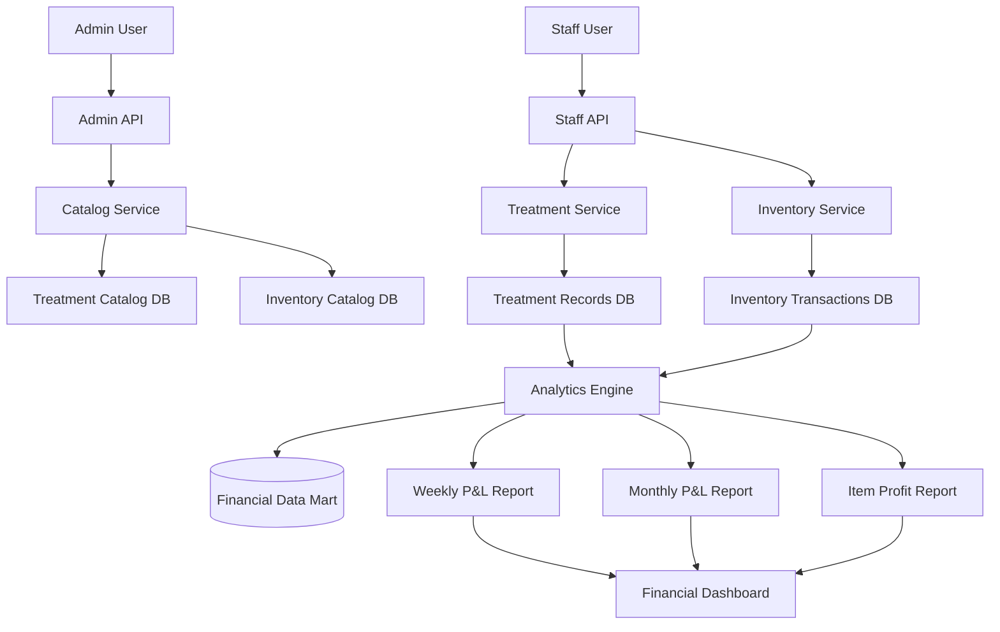
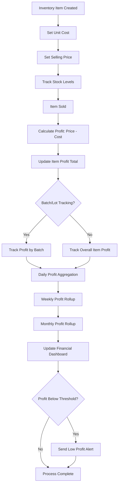
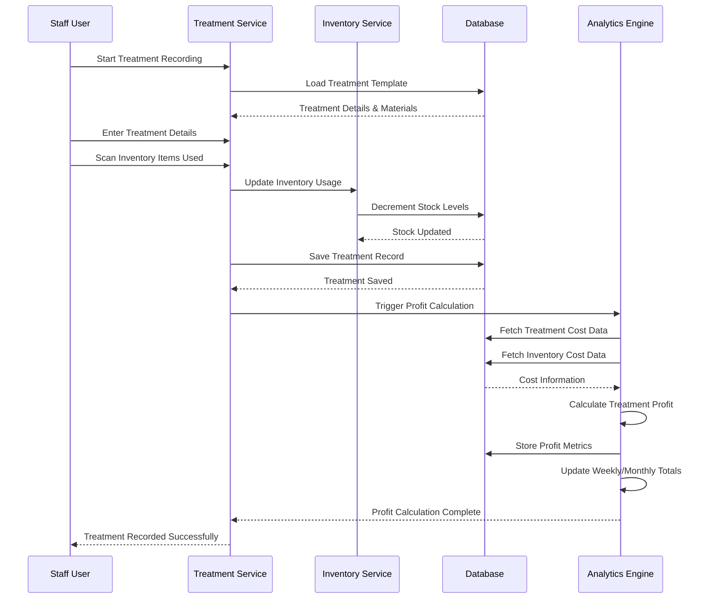

# Clinic CRM & Patient Engagement App - Subsystem Development Plan (v1.0)

## Introduction
This document outlines a modular, subsystem-based development plan for the Clinic CRM & Patient Engagement App. Each subsystem is designed to be developed, tested, and run standalone before integration into the complete system. This approach enables incremental delivery, reduces integration risks, and allows parallel development.

## Subsystem Definitions

### 1. **Tenant & Licensing Core Subsystem**
**Purpose**: Multi-tenant foundation, clinic isolation, licensing tier management
- Clinic tenant registration and configuration
- License tier definitions and limits
- Usage monitoring and threshold detection
- Tier upgrade/downgrade workflows
- Billing integration (Stripe)
- Admin notification system for tier alerts

### 2. **Patient Identity & Onboarding Subsystem**
**Purpose**: Patient registration, authentication, and identification
- QR code generation and validation
- Patient registration flow
- Barcode assignment and management
- Patient profile management
- Medical history storage
- Multi-language support

### 3. **Appointment & Scheduling Subsystem**
**Purpose**: Appointment booking, management, and calendar
- Bi-weekly calendar view
- Two booking modes (specific time vs time period)
- Doctor schedule management
- Availability calculation
- Appointment confirmation/cancellation
- Check-in/check-out workflow
- Reminder notifications

### 4. **Treatment Management Subsystem**
**Purpose**: Treatment catalog and patient treatment records
- Treatment catalog management (admin)
- Treatment record creation and updates (staff)
- Treatment suggestions engine
- Follow-up tracking
- Barcode verification for treatments
- Materials usage tracking

### 5. **Inventory & Supply Chain Subsystem**
**Purpose**: Clinic inventory tracking and control
- Inventory catalog management
- Barcode-based inventory tracking
- Stock level monitoring
- Low-stock alerts
- Supplier management
- Inventory usage history
- Reordering workflow

### 6. **Financial & Billing Subsystem**
**Purpose**: Payment processing, revenue tracking, profit/loss
- Payment record management
- Treatment pricing and cost calculation
- Inventory cost tracking
- Profit/loss calculation by item and lot
- Weekly/monthly financial summaries
- Discount and promotion management

### 7. **Communication & Notification Subsystem**
**Purpose**: Patient-clinic communication and alerts
- In-app chat system
- Department-based routing
- Push notifications (FCM/APNS)
- Email notifications (SES)
- SMS notifications
- Notification preferences

### 8. **Reporting & Analytics Subsystem**
**Purpose**: Clinic performance and business intelligence
- Appointment reports
- Treatment reports
- Revenue reports
- Patient growth analytics
- Staff performance metrics
- Custom report generation
- Data export functionality

### 9. **Admin Dashboard Subsystem**
**Purpose**: Clinic administration and configuration
- Clinic settings management
- Staff role and permission management
- Treatment catalog administration
- Inventory catalog administration
- License tier monitoring
- System configuration

### 10. **Staff Dashboard Subsystem**
**Purpose**: Clinic staff daily operations
- Appointment management
- Patient check-in/check-out
- Treatment recording
- Inventory control
- Patient communication
- Quick barcode scanning

### 11. **Patient Mobile App Subsystem**
**Purpose**: Patient-facing mobile application
- Appointment booking
- Treatment history view
- Payment history
- Chat with clinic
- QR code display
- Push notifications

### 12. **API Gateway & Integration Subsystem**
**Purpose**: External service integration and API management
- External API integrations (Stripe, FCM, APNS, SES)
- Webhook handling
- Rate limiting and security
- Service monitoring
- Circuit breaker implementation

## Sprint 1 Focus: Financial Analytics & Catalog Management Subsystem

### Overview
Sprint 1 combines elements from three subsystems to create a standalone financial analytics module with catalog management capabilities.

**Primary Components:**
1. **Admin Dashboard** - Treatment & Inventory Catalog Management
2. **Staff Dashboard** - Treatment Recording & Inventory Control
3. **Financial Analytics** - Profit/Loss Calculation

### PRD for Sprint 1 Subsystem

#### Features
1. **Treatment Catalog Management** (Admin)
   - Create, read, update, delete treatment items
   - Set base prices and costs
   - Define material requirements
   - Categorize treatments (Cosmetic, Therapeutic, etc.)
   - Set treatment durations

2. **Inventory Catalog Management** (Admin)
   - Manage inventory items with SKUs
   - Set unit costs and selling prices
   - Define minimum/maximum stock levels
   - Track suppliers and reorder points
   - Assign barcodes to inventory items

3. **Treatment Record Updates** (Staff)
   - Record completed treatments
   - Track materials used from inventory
   - Record treatment costs and final amounts
   - Update patient treatment history
   - Barcode verification for treatments

4. **Inventory Control** (Staff)
   - Scan barcodes for inventory usage
   - Update stock levels in real-time
   - Process inventory adjustments
   - View low-stock alerts
   - Track inventory usage by treatment

5. **Profit/Loss Calculation**
   - Calculate profit per inventory item (sell price - cost)
   - Track profit by lot (batch tracking)
   - Calculate treatment service profitability
   - Generate weekly profit/loss summary
   - Generate monthly financial reports
   - Visualize profit trends over time

#### System Architecture



#### Technology Stack Table

| Category              | Technology      | Version | Purpose            | Rationale                                |
| --------------------- | --------------- | ------- | ------------------ | ---------------------------------------- |
| **Backend Framework** | NestJS          | 10.0.0  | API framework      | TypeScript support, modular architecture |
| **Database**          | PostgreSQL      | 15.0    | Primary data store | ACID compliance, JSON support            |
| **ORM**               | Prisma          | 5.0.0   | Database client    | Type safety, migrations                  |
| **API Documentation** | Swagger/OpenAPI | 3.0.0   | API documentation  | Standardized API specs                   |
| **Testing Framework** | Jest            | 29.0.0  | Unit testing       | Comprehensive testing capabilities       |
| **E2E Testing**       | Supertest       | 6.3.3   | API testing        | HTTP assertion library                   |
| **Containerization**  | Docker          | 20.10.0 | Container runtime  | Environment consistency                  |
| **CI/CD**             | GitHub Actions  | -       | Automation         | GitHub integration                       |

#### MVP Scope

**Phase 1 (Week 1-2): Catalog Management Foundation**
- Basic CRUD for treatment catalog
- Basic CRUD for inventory catalog
- Simple database schema with cost/price fields
- Admin dashboard UI for catalog management

**Phase 2 (Week 3-4): Treatment & Inventory Workflows**
- Treatment recording with material usage tracking
- Inventory stock level updates
- Barcode scanning simulation
- Staff dashboard for daily operations

**Phase 3 (Week 5-6): Financial Analytics**
- Profit calculation per inventory item
- Treatment profitability analysis
- Weekly summary reports
- Basic financial dashboard

#### Block Diagram

```
┌─────────────────┐    ┌─────────────────┐    ┌─────────────────┐
│   Admin Portal  │    │   Staff Portal  │    │    Analytics    │
│   (React/Next)  │    │   (React/Next)  │    │    Dashboard    │
└────────┬────────┘    └────────┬────────┘    └────────┬────────┘
         │                      │                      │
         ▼                      ▼                      ▼
┌─────────────────────────────────────────────────────────────┐
│                    API Gateway (NestJS)                     │
└──────────────┬────────────────┬────────────────┬────────────┘
               │                │                │
    ┌──────────▼─────┐ ┌────────▼────────┐ ┌────▼────────────┐
    │ Catalog Service│ │Treatment Service│ │Inventory Service│
    └────────┬───────┘ └────────┬────────┘ └─────┬───────────┘
             │                  │                 │
    ┌────────▼──────────────────▼─────────────────▼──────────┐
    │              PostgreSQL Database Cluster               │
    │  ┌─────────────┐  ┌─────────────┐  ┌─────────────┐   │
    │  │   Catalog   │  │  Treatment  │  │  Inventory  │   │
    │  │    Tables   │  │    Tables   │  │    Tables   │   │
    │  └─────────────┘  └─────────────┘  └─────────────┘   │
    └───────────────────────────────────────────────────────┘
             │                  │                 │
    ┌────────▼──────────────────▼─────────────────▼──────────┐
    │              Analytics & Reporting Engine              │
    │  ┌─────────────┐  ┌─────────────┐  ┌─────────────┐   │
    │  │  Financial  │  │    Weekly   │  │   Monthly   │   │
    │  │   Data Mart │  │  Summaries  │  │   Reports   │   │
    │  └─────────────┘  └─────────────┘  └─────────────┘   │
    └───────────────────────────────────────────────────────┘
```

#### Flow Chart: Inventory Profit Calculation



#### Sequence Chart: Treatment Recording with Profit Calculation



#### Test Criteria

**Unit Tests:**
1. Catalog Service Tests
   - Treatment catalog CRUD operations
   - Inventory catalog CRUD operations
   - Price validation rules
   - Cost calculation accuracy

2. Treatment Service Tests
   - Treatment recording validation
   - Material usage tracking
   - Cost calculation for treatments
   - Profit margin calculations

3. Inventory Service Tests
   - Stock level updates
   - Low-stock alert triggers
   - Inventory cost tracking
   - Reorder point calculations

4. Analytics Engine Tests
   - Profit calculation accuracy
   - Weekly aggregation logic
   - Monthly rollup calculations
   - Financial report generation

**Integration Tests:**
1. End-to-End Catalog Management
   - Admin creates treatment catalog item
   - Staff uses catalog item in treatment
   - Inventory deducted correctly
   - Profit calculated accurately

2. Financial Reporting Flow
   - Multiple treatments recorded
   - Inventory items consumed
   - Weekly report generated
   - Monthly summary accurate

**Acceptance Criteria:**
1. Admin can manage treatment catalog with prices and costs
2. Admin can manage inventory catalog with purchase costs
3. Staff can record treatments and consume inventory
4. System calculates profit per inventory item
5. System calculates profit per treatment
6. Weekly profit/loss report is generated accurately
7. Monthly financial summary includes all transactions
8. Dashboard displays profit trends visually

## Development Roadmap

### Sprint 1 (6 weeks): Financial Analytics & Catalog Management
**Focus**: Building the foundation for financial tracking with catalog management
- Week 1-2: Catalog Management MVP
- Week 3-4: Treatment & Inventory Workflows
- Week 5-6: Financial Analytics & Reporting

### Sprint 2 (4 weeks): Tenant & Licensing Core
**Focus**: Multi-tenant foundation and license management
- Clinic tenant registration
- License tier definitions
- Usage monitoring
- Tier threshold alerts

### Sprint 3 (4 weeks): Patient Identity & Onboarding
**Focus**: Patient registration and identification system
- QR code generation
- Patient registration flow
- Barcode assignment
- Patient profile management

### Sprint 4 (4 weeks): Appointment & Scheduling
**Focus**: Appointment booking and calendar system
- Bi-weekly calendar
- Doctor schedule management
- Booking workflows
- Reminder system

### Sprint 5 (4 weeks): Communication & Notification
**Focus**: Patient-clinic communication channels
- In-app chat system
- Push notifications
- Email integration
- Notification preferences

### Sprint 6 (4 weeks): Mobile Applications
**Focus**: Patient and staff mobile apps
- Patient mobile app (booking, records, chat)
- Staff mobile app (daily operations, scanning)
- Offline capabilities
- Push notifications

### Sprint 7 (4 weeks): Advanced Reporting & Integration
**Focus**: Complete reporting and external integrations
- Advanced analytics
- External API integrations
- Payment processing
- System optimization

## Integration Strategy

### Phase 1: Standalone Subsystems
Each subsystem developed and tested independently with mock interfaces for dependencies.

### Phase 2: Subsystem Integration
1. Financial Analytics ↔ Treatment/Inventory Subsystems
2. Tenant Core ↔ All Other Subsystems
3. Appointment ↔ Patient Identity
4. Communication ↔ All User-Facing Subsystems

### Phase 3: End-to-End Testing
Complete system integration with real data flows and user acceptance testing.

## Success Metrics

### Technical Metrics
- Each subsystem achieves 85% unit test coverage
- Subsystem integration completes with <5% defect rate
- API response times <200ms for 95% of requests
- System availability >99.5% during business hours

### Business Metrics
- Clinic onboarding time reduced by 70%
- Appointment scheduling time reduced by 60%
- Inventory tracking accuracy improved to >99%
- Financial reporting generation time reduced by 80%

---

**Sprint 1 Belongs To**: Financial Analytics & Catalog Management Subsystem (combining elements from Treatment Management, Inventory Management, and Reporting subsystems)

**Next Development Priority**: After Sprint 1, the **Tenant & Licensing Core Subsystem** should be developed next as it provides the foundation for all other subsystems and enables proper multi-tenant isolation.