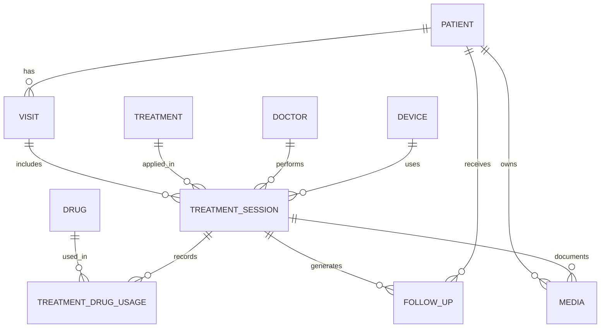

Below is a **production-ready ERD / Database Schema + API Specification** tailored for a **medical beauty clinic app**, aligned with the treatment items and flows we just defined.
This is written so it can be **directly used by backend / frontend / PM** and plugged into your **v0.9.x PRD**.

---

# PART 1 — ERD / Database Schema

## 1️⃣ High-Level ERD (Mermaid)



---

## 2️⃣ Core Tables (Detailed Schema)

---

### 🧑‍⚕️ PATIENT

```sql
PATIENT
- patient_id (PK, UUID)
- full_name
- gender
- date_of_birth
- phone
- email
- skin_type              -- Fitzpatrick I–VI
- medical_history        -- text / JSON
- allergy_notes
- created_at
- updated_at
```

---

### 👨‍⚕️ DOCTOR

```sql
DOCTOR
- doctor_id (PK)
- full_name
- license_no
- specialty
- status                 -- active / inactive
```

---

### 🏥 VISIT (One clinic visit may contain multiple treatments)

```sql
VISIT
- visit_id (PK)
- patient_id (FK)
- visit_date
- visit_type             -- consultation / treatment
- notes
```

---

### 💉 TREATMENT (Master Data)

```sql
TREATMENT
- treatment_id (PK)
- treatment_code         -- e.g. BOT_MASSETER
- treatment_name
- category               -- Injection / Device / Laser
- default_unit           -- U / lines / cc / session
- base_price
- description
- is_active
```

---

### ⚙️ DEVICE (Energy-based systems)

```sql
DEVICE
- device_id (PK)
- device_name
- device_type            -- HIFU / RF / Laser
- manufacturer
- model
- maintenance_cycle_days
```

---

### 🧪 DRUG

```sql
DRUG
- drug_id (PK)
- drug_name
- drug_type              -- Botox / HA / PRP
- unit                   -- U / cc / vial
- supplier
- expiry_date
```

---

### 🧾 TREATMENT_SESSION (Core Clinical Record)

```sql
TREATMENT_SESSION
- session_id (PK)
- visit_id (FK)
- patient_id (FK)
- treatment_id (FK)
- doctor_id (FK)
- device_id (FK, nullable)
- session_no
- dosage_value           -- e.g. 40 (U), 1000 (lines)
- dosage_unit
- treatment_area         -- JSON (left/right/face)
- performed_at
- immediate_reaction     -- redness, swelling
- clinical_notes
```

---

### 💊 TREATMENT_DRUG_USAGE

```sql
TREATMENT_DRUG_USAGE
- usage_id (PK)
- session_id (FK)
- drug_id (FK)
- amount_used
- unit
```

---

### 📅 FOLLOW_UP (Medical & Marketing Critical)

```sql
FOLLOW_UP
- followup_id (PK)
- patient_id (FK)
- session_id (FK)
- followup_type          -- medical / maintenance / reminder
- scheduled_date
- actual_date
- outcome_notes
- next_recommend_date
- notify_flag            -- boolean
```

---

### 🖼 MEDIA (Before / After / Consent)

```sql
MEDIA
- media_id (PK)
- patient_id (FK)
- session_id (FK)
- media_type             -- before / after / consent
- media_url
- captured_at
```

---

# PART 2 — API Specification (Treatment + Follow-up)

Designed as **REST APIs**, mobile + web friendly.

---

## 1️⃣ Patient & Visit APIs

### ➕ Create Patient

`POST /api/patients`

```json
{
  "full_name": "Amy Chen",
  "gender": "female",
  "date_of_birth": "1992-06-01",
  "skin_type": "III",
  "medical_history": "No autoimmune disease"
}
```

---

### ➕ Create Visit

`POST /api/visits`

```json
{
  "patient_id": "uuid",
  "visit_type": "treatment",
  "visit_date": "2025-12-20"
}
```

---

## 2️⃣ Treatment APIs

---

### 📋 Get Available Treatments

`GET /api/treatments`

**Response**

```json
[
  {
    "treatment_id": "BOT_MASSETER",
    "treatment_name": "美國肉毒瘦小臉",
    "category": "Injection",
    "default_unit": "U",
    "base_price": 4999
  }
]
```

---

### 💉 Create Treatment Session

`POST /api/treatment-sessions`

```json
{
  "visit_id": "uuid",
  "patient_id": "uuid",
  "treatment_id": "BOT_MASSETER",
  "doctor_id": "doc_01",
  "dosage_value": 40,
  "dosage_unit": "U",
  "treatment_area": {
    "left_masseter": 20,
    "right_masseter": 20
  },
  "clinical_notes": "Normal injection, no bleeding"
}
```

---

### 🧪 Record Drug Usage

`POST /api/treatment-drug-usage`

```json
{
  "session_id": "session_uuid",
  "drug_id": "BOTOX_US",
  "amount_used": 40,
  "unit": "U"
}
```

---

## 3️⃣ Follow-up & Maintenance APIs

---

### 📅 Create Follow-up Plan (Auto-generated after treatment)

`POST /api/followups`

```json
{
  "patient_id": "uuid",
  "session_id": "session_uuid",
  "followup_type": "medical",
  "scheduled_date": "2026-01-05",
  "notify_flag": true
}
```

---

### 🔔 Get Upcoming Follow-ups (Dashboard)

`GET /api/followups?days=30`

```json
[
  {
    "patient_name": "Amy Chen",
    "treatment": "美國肉毒瘦小臉",
    "scheduled_date": "2026-01-05",
    "followup_type": "medical"
  }
]
```

---

### ♻️ Create Maintenance Re-treatment Recommendation

`POST /api/followups/recommend`

```json
{
  "session_id": "session_uuid",
  "next_recommend_date": "2026-05-20",
  "followup_type": "maintenance",
  "notify_flag": true
}
```

---

## 4️⃣ Dashboard-Oriented APIs (Very Important for Clinic Owners)

---

### 📊 Treatment Performance

`GET /api/dashboard/treatments`

**Response**

```json
{
  "treatment_name": "海芙音波",
  "monthly_sessions": 128,
  "repeat_rate": 0.62,
  "avg_revenue": 38000
}
```

---

### ⚠️ Expiring Follow-ups (Lost Revenue Prevention)

`GET /api/dashboard/followup-risk`

```json
{
  "patient_id": "uuid",
  "last_treatment": "Botox",
  "days_since_last": 190,
  "status": "overdue"
}
```

---

# PART 3 — Why This Design Works for Medical Beauty Clinics

✔ Supports **medical compliance** (doctor → session → drug traceability)
✔ Enables **auto re-treatment reminders** (critical revenue driver)
✔ Matches **device / injection hybrid clinics**
✔ Ready for **LINE / WhatsApp / SMS notification integration**
✔ Scales to **pricing tiers & license control** (from your earlier PRD)

---

