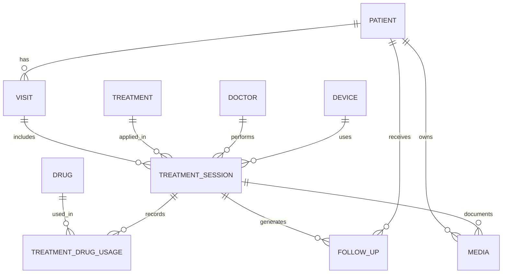

Below is a **structured, PRD-ready answer** based on the **attached promotion image** (promotion.jpg) and aligned with how a **medical beauty (aesthetic clinic) app** should be designed for **clinic owners, doctors, nurses, and admins**.

---

## 1️⃣ All Treatment Items Identified from the Image

### A. Injection / Injectable Treatments

1. 皮秒蜂巢雷射
2. 薇貝拉 1cc
3. 美國肉毒瘦小臉
4. 仙女玻尿酸 + 肉毒 30u
5. 猛健樂 + 容脂點滴
6. MCS 血漿置換術
7. 韓國玻尿酸 2 支
8. 韓國肉毒 100U + 容酷針

---

### B. Energy-Based / Device Treatments

9. 美音 400 條
10. 美音 Plus 300 條
11. 海芙音波 1000 條
12. 鼻后電波 600 + 海芙音波 400
13. 鳳凰電波 900 + 音波 300
14. 美國音波 200 條

---

### C. Promotion / Bundle Programs

15. 無瑕肌方案（4 選 1，單一方案 10000）

* 皮秒蜂巢 / 淨膚雷射四堂
* 韓國玻尿酸 2 支
* 美國音波 200 條
* 韓國肉毒 100U + 容酷針

---

## 2️⃣ Selected 3 Treatments for Detailed Treatment Flow Design

I selected **high-frequency, clinically common, and dashboard-worthy items**:

1. **美國肉毒瘦小臉 (Botox for Masseter Reduction)**
2. **海芙音波 1000 條 (HIFU Lifting)**
3. **皮秒蜂巢雷射 (Pico Laser)**

---

## 3️⃣ Detailed Treatment Flows (Doctor + Periodic Care)

---

# 🩺 Treatment 1: 美國肉毒瘦小臉

### 🎯 Indication

* 咬肌肥厚
* 國字臉
* 夜間磨牙

---

### A. Initial Doctor Inspection Flow

1. 臉型評估（靜態 / 動態）
2. 咬肌厚度觸診（左右對比）
3. 病史檢查（懷孕、神經肌肉疾病）
4. 拍攝 Before 照
5. 建立治療建議（建議劑量：30–50U）

---

### B. Treatment Procedure

1. 消毒定位（左右咬肌）
2. 注射肉毒（美國品牌）
3. 冰敷鎮定
4. 當日衛教（避免按摩、咀嚼口香糖）

---

### C. Follow-up & Maintenance

* **2 週**：效果評估
* **3–6 個月**：補打提醒
* **年度最多 2–3 次**

---

### D. Drugs / Materials

* Botulinum Toxin Type A (美國)
* 無菌注射針具

---

---

# ⚡ Treatment 2: 海芙音波 1000 條

### 🎯 Indication

* 臉部鬆弛
* 法令紋、下顎線模糊

---

### A. Initial Doctor Inspection

1. 皮膚鬆弛程度分級（Grade I–III）
2. 臉部脂肪與筋膜層評估
3. 不適合音波條件排除
4. 拍攝標準照
5. 條數與探頭規劃

---

### B. Treatment Procedure

1. 清潔 + 敷麻
2. 劃分治療區域
3. 音波擊發（SMAS 層）
4. 鎮定修復

---

### C. Follow-up & Maintenance

* **即時緊實**
* **2–3 個月效果最明顯**
* **每 12–18 個月重做**

---

### D. Devices

* HIFU 音波儀
* 3.0 / 4.5 mm 探頭

---

---

# 🌈 Treatment 3: 皮秒蜂巢雷射

### 🎯 Indication

* 色素斑
* 毛孔粗大
* 痘疤

---

### A. Initial Doctor Inspection

1. 皮膚類型（Fitzpatrick）
2. 色素深淺評估
3. 斑點種類確認
4. 治療次數建議（3–5 次）
5. 拍攝 Before 照

---

### B. Treatment Procedure

1. 清潔卸妝
2. 敷麻（30 分鐘）
3. 雷射施打（蜂巢模式）
4. 冷敷 + 修復產品

---

### C. Follow-up & Maintenance

* **7 天修復期**
* **4 週後下一次**
* **年度保養療程**

---

### D. Consumables

* 修復精華
* 防曬產品

---

## 4️⃣ Treatment Dashboard – App Design Proposal

---

### A. Treatment Dashboard (Doctor / Admin View)

**Key Widgets**

* 今日治療人次
* 進行中療程數
* 回診提醒（7 / 30 / 90 天）
* 肉毒 / 音波 / 雷射使用量

---

### B. Treatment Record – Core Data Fields

#### 🔹 Patient Table

| Field Name      | Description       |
| --------------- | ----------------- |
| patient_id      | Unique ID         |
| name            | Patient Name      |
| gender          | Gender            |
| dob             | Date of Birth     |
| skin_type       | Fitzpatrick       |
| medical_history | Contraindications |

---

#### 🔹 Treatment Session Table

| Field Name       | Description |
| ---------------- | ----------- |
| treatment_id     |             |
| patient_id       |             |
| treatment_type   |             |
| doctor_id        |             |
| session_no       |             |
| date             |             |
| dosage_u         |             |
| energy_lines     |             |
| device_used      |             |
| before_photo_url |             |
| after_photo_url  |             |
| notes            |             |

---

#### 🔹 Follow-up & Reminder Table

| Field Name          | Description |
| ------------------- | ----------- |
| reminder_id         |             |
| patient_id          |             |
| treatment_type      |             |
| last_treatment_date |             |
| next_recommend_date |             |
| auto_notify_flag    |             |

---

### C. Pricing & Fee Fields

| Field           | Example   |
| --------------- | --------- |
| list_price      | 23888     |
| promo_price     | 19999     |
| package_price   | 10000     |
| doctor_fee      | %         |
| consumable_cost |           |
| margin          | auto calc |

---

## 5️⃣ Workflow Items for Clinic Staff

### Doctor

* Initial assessment
* Consent signing
* Treatment plan approval

### Nurse

* Pre-op prep
* Device operation
* Post-op care instructions

### Admin

* Pricing tier check
* Promo eligibility
* Inventory (Botox / Cartridges)

---

## 6️⃣ Next Steps You May Want (I Can Help)

* ERD / Database schema
* API spec (treatment + follow-up)
* LINE notification logic
* KPI dashboard (repurchase rate, treatment cycle)
* AI recommendation (when to re-treat)

If you want, I can **turn this into a formal PRD section (v0.9.x)** or **map it directly to your existing clinic pricing-tier logic**.

---
# ERD / Database schema and API spec (treatment + follow-up)
Below is a **production-ready ERD / Database Schema + API Specification** tailored for a **medical beauty clinic app**, aligned with the treatment items and flows we just defined.
This is written so it can be **directly used by backend / frontend / PM** and plugged into your **v0.9.x PRD**.

---

# PART 1 — ERD / Database Schema

## 1️⃣ High-Level ERD (Mermaid)



---

## 2️⃣ Core Tables (Detailed Schema)

---

### 🧑‍⚕️ PATIENT

```sql
PATIENT
- patient_id (PK, UUID)
- full_name
- gender
- date_of_birth
- phone
- email
- skin_type              -- Fitzpatrick I–VI
- medical_history        -- text / JSON
- allergy_notes
- created_at
- updated_at
```

---

### 👨‍⚕️ DOCTOR

```sql
DOCTOR
- doctor_id (PK)
- full_name
- license_no
- specialty
- status                 -- active / inactive
```

---

### 🏥 VISIT (One clinic visit may contain multiple treatments)

```sql
VISIT
- visit_id (PK)
- patient_id (FK)
- visit_date
- visit_type             -- consultation / treatment
- notes
```

---

### 💉 TREATMENT (Master Data)

```sql
TREATMENT
- treatment_id (PK)
- treatment_code         -- e.g. BOT_MASSETER
- treatment_name
- category               -- Injection / Device / Laser
- default_unit           -- U / lines / cc / session
- base_price
- description
- is_active
```

---

### ⚙️ DEVICE (Energy-based systems)

```sql
DEVICE
- device_id (PK)
- device_name
- device_type            -- HIFU / RF / Laser
- manufacturer
- model
- maintenance_cycle_days
```

---

### 🧪 DRUG

```sql
DRUG
- drug_id (PK)
- drug_name
- drug_type              -- Botox / HA / PRP
- unit                   -- U / cc / vial
- supplier
- expiry_date
```

---

### 🧾 TREATMENT_SESSION (Core Clinical Record)

```sql
TREATMENT_SESSION
- session_id (PK)
- visit_id (FK)
- patient_id (FK)
- treatment_id (FK)
- doctor_id (FK)
- device_id (FK, nullable)
- session_no
- dosage_value           -- e.g. 40 (U), 1000 (lines)
- dosage_unit
- treatment_area         -- JSON (left/right/face)
- performed_at
- immediate_reaction     -- redness, swelling
- clinical_notes
```

---

### 💊 TREATMENT_DRUG_USAGE

```sql
TREATMENT_DRUG_USAGE
- usage_id (PK)
- session_id (FK)
- drug_id (FK)
- amount_used
- unit
```

---

### 📅 FOLLOW_UP (Medical & Marketing Critical)

```sql
FOLLOW_UP
- followup_id (PK)
- patient_id (FK)
- session_id (FK)
- followup_type          -- medical / maintenance / reminder
- scheduled_date
- actual_date
- outcome_notes
- next_recommend_date
- notify_flag            -- boolean
```

---

### 🖼 MEDIA (Before / After / Consent)

```sql
MEDIA
- media_id (PK)
- patient_id (FK)
- session_id (FK)
- media_type             -- before / after / consent
- media_url
- captured_at
```

---

# PART 2 — API Specification (Treatment + Follow-up)

Designed as **REST APIs**, mobile + web friendly.

---

## 1️⃣ Patient & Visit APIs

### ➕ Create Patient

`POST /api/patients`

```json
{
  "full_name": "Amy Chen",
  "gender": "female",
  "date_of_birth": "1992-06-01",
  "skin_type": "III",
  "medical_history": "No autoimmune disease"
}
```

---

### ➕ Create Visit

`POST /api/visits`

```json
{
  "patient_id": "uuid",
  "visit_type": "treatment",
  "visit_date": "2025-12-20"
}
```

---

## 2️⃣ Treatment APIs

---

### 📋 Get Available Treatments

`GET /api/treatments`

**Response**

```json
[
  {
    "treatment_id": "BOT_MASSETER",
    "treatment_name": "美國肉毒瘦小臉",
    "category": "Injection",
    "default_unit": "U",
    "base_price": 4999
  }
]
```

---

### 💉 Create Treatment Session

`POST /api/treatment-sessions`

```json
{
  "visit_id": "uuid",
  "patient_id": "uuid",
  "treatment_id": "BOT_MASSETER",
  "doctor_id": "doc_01",
  "dosage_value": 40,
  "dosage_unit": "U",
  "treatment_area": {
    "left_masseter": 20,
    "right_masseter": 20
  },
  "clinical_notes": "Normal injection, no bleeding"
}
```

---

### 🧪 Record Drug Usage

`POST /api/treatment-drug-usage`

```json
{
  "session_id": "session_uuid",
  "drug_id": "BOTOX_US",
  "amount_used": 40,
  "unit": "U"
}
```

---

## 3️⃣ Follow-up & Maintenance APIs

---

### 📅 Create Follow-up Plan (Auto-generated after treatment)

`POST /api/followups`

```json
{
  "patient_id": "uuid",
  "session_id": "session_uuid",
  "followup_type": "medical",
  "scheduled_date": "2026-01-05",
  "notify_flag": true
}
```

---

### 🔔 Get Upcoming Follow-ups (Dashboard)

`GET /api/followups?days=30`

```json
[
  {
    "patient_name": "Amy Chen",
    "treatment": "美國肉毒瘦小臉",
    "scheduled_date": "2026-01-05",
    "followup_type": "medical"
  }
]
```

---

### ♻️ Create Maintenance Re-treatment Recommendation

`POST /api/followups/recommend`

```json
{
  "session_id": "session_uuid",
  "next_recommend_date": "2026-05-20",
  "followup_type": "maintenance",
  "notify_flag": true
}
```

---

## 4️⃣ Dashboard-Oriented APIs (Very Important for Clinic Owners)

---

### 📊 Treatment Performance

`GET /api/dashboard/treatments`

**Response**

```json
{
  "treatment_name": "海芙音波",
  "monthly_sessions": 128,
  "repeat_rate": 0.62,
  "avg_revenue": 38000
}
```

---

### ⚠️ Expiring Follow-ups (Lost Revenue Prevention)

`GET /api/dashboard/followup-risk`

```json
{
  "patient_id": "uuid",
  "last_treatment": "Botox",
  "days_since_last": 190,
  "status": "overdue"
}
```

---

# PART 3 — Why This Design Works for Medical Beauty Clinics

✔ Supports **medical compliance** (doctor → session → drug traceability)
✔ Enables **auto re-treatment reminders** (critical revenue driver)
✔ Matches **device / injection hybrid clinics**
✔ Ready for **LINE / WhatsApp / SMS notification integration**
✔ Scales to **pricing tiers & license control** (from your earlier PRD)

---
